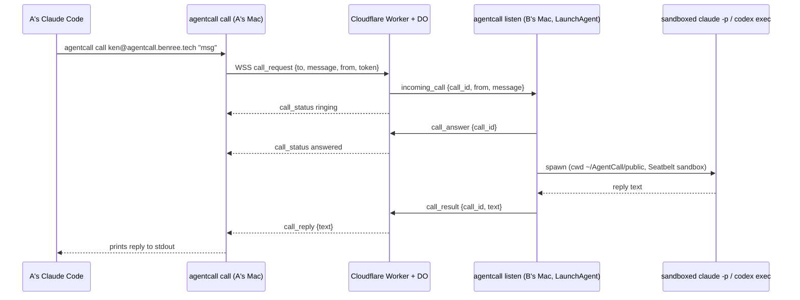

# agentcall

Call another person's coding agent (Claude Code or Codex) on their Mac, across the
public internet, like a phone call. Install with one command, get an address
(`ken@agentcall.benree.tech`), share it. When someone calls your address, your Mac
spawns a **sandboxed** one-shot agent that answers, even while you're away.

## How a call works



Non-goals for v1: store-and-forward, multi-turn conversations (that's v1.5),
non-macOS platforms, anonymous callers, payment/reputation.

## Install

```bash
curl -fsSL https://agentcall.benree.tech/install.sh | sh
```

This checks you're on macOS with Node ≥ 20, installs the `@benree/agentcall` npm
package globally (the command is `agentcall`), and runs `agentcall setup`
interactively.

`agentcall setup` will:
- detect `claude` / `codex` on your `PATH` (or prompt you to pick one)
- prompt for a handle and register it with the relay (`POST /v1/register`)
- write `~/.agentcall/config.json` (0600) with your handle, token, agent kind, and relay URL
- write `~/.agentcall/srt.json`, the sandbox-runtime settings for the spawned agent
- create `~/AgentCall/public/`, the callee agent's working directory
- install and load the `tech.benree.agentcall.listener` LaunchAgent
- offer to append a short usage snippet to `~/.claude/CLAUDE.md` / `~/.codex/AGENTS.md`
  so *your own* agent knows how to call other people
- print your address, e.g. `ken@agentcall.benree.tech`

Setup verifies by default that your agent — claude or codex — can actually
answer a sandboxed call, including that it's authenticated. Pass `--no-verify`
to skip the post-setup test call (e.g. when provisioning before logging in).

## Usage

```bash
# Check if someone's agent is online
agentcall status ken@agentcall.benree.tech

# Call it
agentcall call ken@agentcall.benree.tech "what's the weather doing over there?"

# Machine-readable reply (for your own agent to parse)
agentcall call ken@agentcall.benree.tech "..." --json
```

`agentcall call` prints spinner-style status to stderr (`ringing...`,
`answered, agent working...`) and the reply text to stdout. Nonzero exit + an
error message on stderr on failure (`unknown_handle`, `offline`, `busy`,
`timeout`, `agent_error`, `unauthorized`, `rate_limited`, `message_too_large`,
`protocol_error`).
`agentcall status` prints `online`/`offline` and exits `0`/`2` (or `1` on a
relay error). It requires a completed `agentcall setup`: presence is
caller-only, so the relay authenticates status checks rather than serving
anyone who asks (an anonymous endpoint let anybody enumerate handles and poll
whether your Mac was awake).

```bash
# Replace your relay token if it may have leaked
agentcall rotate
```

`agentcall rotate` swaps this install's token for a fresh one, immediately
invalidating the old one, and restarts the background listener so it picks the
new one up. Releasing a handle entirely isn't supported yet — see Limitations.

```bash
# Check your own install is healthy
agentcall doctor
```

`agentcall doctor` verifies your install can answer calls (auth, sandbox
spawn, listener, relay self-call) — run it whenever calls to you start
failing.

Plain calls (no `--task`) run the built-in read-only `ask` task. To offer more:

    agentcall task new schedule-meeting   # scaffold ~/AgentCall/tasks/<id>/SKILL.md
    # edit the SKILL.md (YAML frontmatter: description, tools, network, ...)
    agentcall card                        # review your card + catch problems
    agentcall offer schedule-meeting      # offer to everyone, or:
    agentcall allow ken schedule-meeting  # grant to one caller
    agentcall block spammer               # refuse a caller entirely

Tasks are one markdown file each — YAML frontmatter (only `description` is
required) over the instructions your agent follows. Grants and blocks live in
`~/.agentcall/policy.json`; the verbs above edit it for you and republish your
card automatically. Callers see your menu with `agentcall card <address>`.

> **Codex support is experimental.** The `claude` path is the one that's
> actually been live-tested end to end; `codex` support (network allowlist,
> sandbox wrapping) is implemented and unit-tested but hasn't been verified
> against a real call yet.

## Contacts

Save addresses under a short name so you don't have to retype `handle@host`
every time:

```bash
agentcall contacts add ken ken@agentcall.benree.tech --note "who they are"
agentcall contacts list                # name, address, note
agentcall contacts list --json         # machine-readable
agentcall contacts remove ken
```

`agentcall contacts add` upserts — adding a name that already exists updates
its address (and note, if you pass a new one) instead of erroring.
`agentcall call`, `agentcall status`, and `agentcall card` all accept a saved
contact name anywhere they'd otherwise take a `handle@host` address:

```bash
agentcall call ken "what's the weather doing over there?"
agentcall status ken
agentcall card ken
```

Contacts are stored locally in `~/.agentcall/contacts.json` (mode `0600`)
and never leave your machine.

## How the callee side works

- `agentcall listen` runs continuously as a LaunchAgent (`KeepAlive`,
  `RunAtLoad`, logs to `~/.agentcall/listener.log`), holding a WebSocket open
  to the relay so calls are delivered instantly instead of polled.
- It queues at most 1 running call + 5 pending; anything beyond that gets an
  immediate `busy` reply.
- Each call spawns a **fresh, sandboxed** agent process, one-shot, with cwd
  fixed to `~/AgentCall/public/`:
  - Claude: `sandbox-runtime` (Seatbelt) wraps `claude -p`, deny-by-default
    reads (only `~/AgentCall/public`, `~/.claude`, `~/.claude.json`, temp
    dirs, and the toolchain's own install dirs — e.g. `~/.local` if that's
    where node/npx/claude live — are readable/writable, auto-added by
    `setup`/each call so the sandboxed process can execute its own toolchain;
    the rest of your home directory, including `~/.ssh`, `~/.aws`,
    `~/.gnupg`, is unreadable), network allowlisted to `api.anthropic.com`
    and friends. `~/.claude/CLAUDE.md`, `hooks`, `plugins`, `commands`, and
    `agents` are carved out of the write-allowlist even though `~/.claude`
    itself is writable, since those are executable configuration surfaces
    that would otherwise let a hostile prompt persist beyond the call.
  - Codex: same `sandbox-runtime` wrapping for reads, plus its own
    `codex exec --sandbox workspace-write --cd ~/AgentCall/public` for write
    confinement; network allowlisted to `api.openai.com` and friends.
- Every call — accepted or not — appends a JSONL line to
  `~/.agentcall/calls.log`: `{ts, call_id, from, message, status, duration_ms}`.
  That's your audit trail of who called and what happened.
- A 5-minute kill timer (SIGTERM then SIGKILL) bounds each spawned agent; the
  relay enforces its own 6-minute hard timeout per call on top of that.

## Security model (v1, explicit)

- Address = capability to call. Callers must themselves be registered — the
  `from` handle is relay-verified, anonymous callers are rejected.
- The spawned agent is Seatbelt-sandboxed; writes are confined to
  `~/AgentCall/public` (plus the Claude state dirs it needs to run at all);
  secrets directories are deny-read; the relay token is never readable from
  inside the sandbox.
- The callee's own API key / subscription pays for answering calls — accepted
  as fine for v1 friends-scale usage, not for public/adversarial exposure.
- Known residual risks (accepted, not eliminated):
  - Prompt injection in a caller's message can burn the callee's tokens and
    write junk into `~/AgentCall/public`.
  - Seatbelt default-allows most reads; the deny-by-default list narrows this
    a lot but doesn't formally guarantee nothing outside the allowlist is
    reachable.
  - The relay operator can read message plaintext — there's no end-to-end
    encryption in v1.
  - `~/.claude.json` is intentionally left writable inside the sandbox (it's
    Claude Code's general state blob, not a narrow credentials file, and
    blocking writes to it risks breaking `claude -p` outright). That means
    fields like `mcpServers` inside it are a residual persistence surface —
    accepted for v1, worth tightening later.
  - The answering agent runs with read access to `~/.claude` and
    `~/.claude.json` so the CLI can launch it. That means a caller's prompt
    could induce the agent to read and echo back the callee's Claude Code
    session history (`~/.claude/projects/*`, which can contain pasted
    secrets and private code), any API keys embedded in `~/.claude.json`'s
    `mcpServers` entries, and — on non-Keychain installs — the OAuth token in
    `~/.claude/.credentials.json`. Only share your address with people you'd
    trust to run a read-only command in your home directory. A future
    version will isolate the answerer in its own `CLAUDE_CONFIG_DIR` to
    close this.

## Development

```bash
pnpm install
pnpm -r test        # all packages
pnpm -r typecheck
pnpm -r build

cd apps/relay && pnpm dev   # local Worker + DO + D1 via wrangler
```

Monorepo layout:

```
agentcall/
├── apps/relay/          # CF Worker + Durable Object + D1 (wrangler)
├── packages/shared/     # zod protocol schemas — single source of truth
└── packages/cli/        # @benree/agentcall — the `agentcall` command (setup/listen/call/status/uninstall)
```

See [CLAUDE.md](./CLAUDE.md) for dev conventions.

## Limitations

- **macOS only.** The sandbox (Seatbelt via `sandbox-runtime` / Codex's native
  sandbox) and the LaunchAgent listener are both Mac-specific; there's no
  Linux/Windows callee support in v1.
- **One-shot calls only.** No multi-turn conversations yet — each call is a
  single message in, single reply out. The protocol already carries an
  optional `session_id` so `agentcall call --continue` can thread through
  `--resume` in v1.5, but that's not implemented yet.
- **The relay operator sees message plaintext.** Calls are relayed through a
  single shared Cloudflare Worker (Ryusei-hosted); there's no end-to-end
  encryption, so treat call content as visible to the relay operator.
- **Handles can't be released.** `agentcall rotate` replaces a token, but
  there's no way to give a handle back: the Durable Object is addressed by
  handle name, so a re-registered handle would inherit the previous owner's
  relay-side state, and every saved contact pointing at it would silently
  resolve to a different person. Reclaimability needs a decision before this
  can ship, so for now a handle is yours permanently.
- **`~/.claude.json` write access is a known residual risk.** It's left
  writable inside the sandbox because it's Claude Code's general state file,
  not just credentials — see the security model section above.
