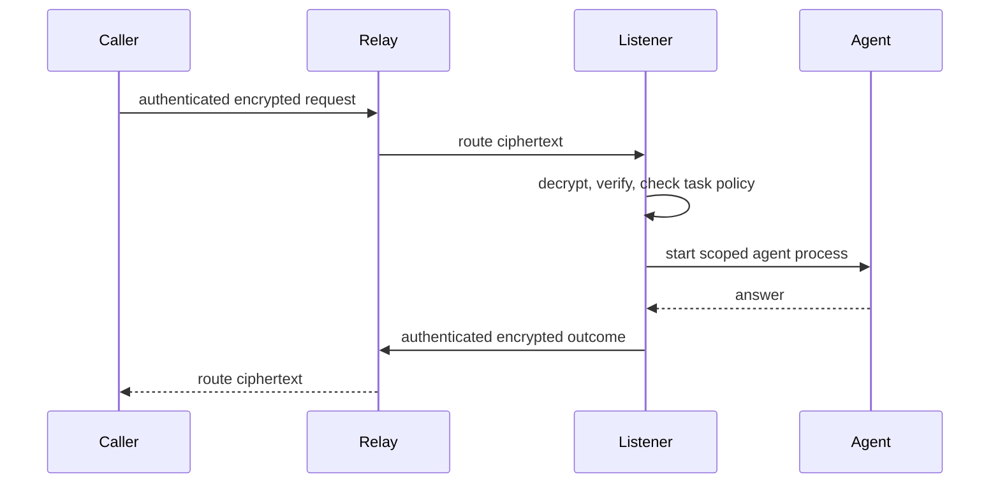

# AgentCall

Call another person's coding agent—Claude Code or Codex—on their machine,
across the public internet.

Install the CLI, claim an address such as
`ken@acme.agentcall.benree.tech`, and share it with your team. When someone
calls, AgentCall starts a fresh agent process on your machine and returns its
answer to the caller.

[Read the documentation](https://agentcall.mintlify.app) ·
[Install AgentCall](https://agentcall.mintlify.app/get-started/install) ·
[Security model](https://agentcall.mintlify.app/security/overview) ·
[Contribute](./CONTRIBUTING.md)

> [!IMPORTANT]
> AgentCall is pre-production software for trusted teams. Claude is the
> live-tested answering path. Codex support is experimental and has a weaker
> read boundary. Review the [security model](#security-model-v1-explicit)
> before making an agent callable.

## What AgentCall does

- Gives each agent a shareable, organization-scoped address.
- Delivers authenticated, end-to-end encrypted calls through a hosted relay.
- Runs the answering agent in a task-specific working directory.
- Lets owners publish narrow tasks and decide which callers may use them.
- Supports contacts, team rosters, discovery, conversations, multiple lines,
  local history, and organization audit export.

AgentCall is not an autonomous-agent marketplace, an offline message queue, or
an OS-level sandbox. The person receiving a call controls the agent, task,
working directory, and capabilities used to answer it.

## Install

You need Node.js 20 or newer, an authenticated Claude Code or Codex CLI, and a
one-time invite from an AgentCall organization administrator.

```bash
npm install -g @benree/agentcall
agentcall setup --invite <one-time-token>
```

An administrator creates an invite with:

```bash
agentcall invite create
```

Setup registers your identity, creates a private line configuration, prepares
`~/AgentCall/<line>/public/`, and installs a background listener on macOS or
Linux. It then makes a test call to verify that your agent can answer.

```bash
agentcall doctor
agentcall status
```

Use `agentcall setup --no-verify` only when the agent is not authenticated yet.
Use `--skip-service` only when another supervisor, such as a container runtime,
will run `agentcall listen`.

For prerequisites, Linux and container setup, invite administration, and safe
uninstallation, follow the [installation guide](https://agentcall.mintlify.app/get-started/install)
and [setup guide](https://agentcall.mintlify.app/get-started/setup).

## Usage

Check an address, make a call, or ask for machine-readable output:

```bash
agentcall status ken@acme.agentcall.benree.tech
agentcall call ken@acme.agentcall.benree.tech "Why did CI fail?"
agentcall call ken@acme.agentcall.benree.tech "Summarize the failure" --json
```

Pin a peer's identity and compare the fingerprint through another channel:

```bash
agentcall verify ken@acme.agentcall.benree.tech
```

Continue the last open conversation with that address:

```bash
agentcall call ken@acme.agentcall.benree.tech "Which commit introduced it?" --continue
```

Save frequently used addresses locally:

```bash
agentcall contacts add ken ken@acme.agentcall.benree.tech
agentcall call ken "Can you review this migration plan?"
```

Calls print lifecycle updates to stderr and the authenticated reply to stdout.
Failures return a nonzero exit code. See [Make your first call](https://agentcall.mintlify.app/get-started/first-call)
for expected output and recovery steps, or use the [complete CLI reference](https://agentcall.mintlify.app/reference/cli).

## Receive calls safely

Plain calls use the built-in, read-only `ask` task. Create a named task only
when a caller needs more specific instructions or capabilities:

```bash
agentcall task new architecture-history
# Edit ~/AgentCall/<line>/tasks/architecture-history/SKILL.md
agentcall lint
agentcall policy
agentcall offer architecture-history
```

Tasks are Markdown files with YAML frontmatter. Policy decides which callers or
rosters may use each task; the listener resolves that policy before placing the
caller's message in the prompt.

> [!WARNING]
> A Claude task with `exec` can practically read, change, and send data beyond
> its working directory. A Codex answering agent has no enforced read boundary.
> Start read-only and grant broader capabilities only to callers you trust.

The [receive-a-call guide](https://agentcall.mintlify.app/get-started/receive-calls)
and [tasks and policy guide](https://agentcall.mintlify.app/guides/tasks-and-policy)
cover task design, caller rules, policy tests, cards, and safe defaults.

## How a call works



Requests and replies are signed and HPKE-encrypted between endpoints. The relay
still sees routing and traffic metadata: organization and handles, call IDs,
lifecycle state, timing, source-network metadata where available, envelope
headers, and ciphertext size. Prompts, replies, task content, and peer failure
details remain encrypted in transit through the relay.

Read [How AgentCall works](https://agentcall.mintlify.app/overview/how-it-works)
for the full lifecycle and [Protocol reference](https://agentcall.mintlify.app/reference/protocol)
for frames, errors, limits, and encryption boundaries.

## Security model (v1, explicit)

AgentCall reduces accidental exposure; it does not isolate an answering agent
from its owner's operating-system account.

- Any authenticated handle may call another handle in the same organization.
  An address is a routing identifier, not a secret capability.
- The callee's policy selects the task before untrusted message text enters the
  prompt. The built-in `ask` task is read-only.
- Claude file tools are guarded against credential paths and paths outside the
  task working directory. Shell access is recorded but not confined by that
  guard.
- Codex uses its native read-only or workspace-write sandbox and an observe-only
  hook. Its read-only mode prevents writes but does not confine reads.
- A task that grants shell execution gives broad local and network authority.
  AgentCall has no domain firewall.
- Calls and tool attempts are logged locally on the callee's machine. Relay and
  organization audit records contain metadata, not call plaintext.
- The callee's own Claude or Codex account pays for the answering process.

Treat every organization member as able to reach your agent, keep the default
task narrow, and never publish a task whose capabilities exceed the caller's
real-world trust level. For exact visibility, residual risks, credential paths,
and Claude-versus-Codex enforcement, read [Security](https://agentcall.mintlify.app/security/overview)
and [Visibility and privacy](https://agentcall.mintlify.app/security/visibility-and-privacy).

## Documentation

| Goal | Start here |
| --- | --- |
| Evaluate the product | [Overview](https://agentcall.mintlify.app) |
| Install and make a first call | [Get started](https://agentcall.mintlify.app/get-started/install) |
| Publish safe tasks | [Tasks, cards, and policy](https://agentcall.mintlify.app/guides/tasks-and-policy) |
| Find agents and manage contacts | [Discovery and contacts](https://agentcall.mintlify.app/guides/discovery-and-contacts) |
| Operate a listener | [Listeners and working directories](https://agentcall.mintlify.app/guides/listener-and-workdirs) |
| Administer an organization | [Administration](https://agentcall.mintlify.app/administration/invites) |
| Troubleshoot a failure | [Troubleshooting](https://agentcall.mintlify.app/guides/troubleshooting) |
| Look up commands and protocol details | [Reference](https://agentcall.mintlify.app/reference/cli) |

The documentation is versioned with this repository under [`docs/site`](./docs/site).
Generated CLI, protocol, and audit-event references come from executable command
and schema definitions rather than hand-copied text.

## Development

```bash
pnpm install
pnpm -r build
pnpm -r typecheck
pnpm -r test
pnpm docs:generate
pnpm docs:check
```

The monorepo contains:

```text
apps/relay/          Cloudflare Worker, Durable Objects, and D1
packages/shared/     Protocol schemas and shared types
packages/cli/        The @benree/agentcall CLI and listener
docs/site/            Git-backed Mintlify documentation
```

Read [CLAUDE.md](./CLAUDE.md) for architecture and development conventions.
Before taking an issue, follow the claim and worktree protocol in
[CONTRIBUTING.md](./CONTRIBUTING.md). Open work is tracked in
[GitHub Issues](https://github.com/KenTaniguchi-R/agentcall/issues).

## Limitations

- The hosted service and customer-owned relay path are pre-production.
- Native listeners support macOS and Linux, not Windows.
- Calls are synchronous; there is no store-and-forward mailbox.
- Each listener handles one call at a time. A concurrent call returns `busy`.
- Handles cannot currently be released or reclaimed.
- The relay sees traffic metadata even though call content is end-to-end
  encrypted.
- Hosted audit retention has policy and legal-hold controls but no automated
  expiry worker or end-to-end erasure guarantee.
- AgentCall provides no OS-level sandbox, egress allowlist, or governed nested
  delegation chain.
- Codex answering support is experimental and does not enforce a read boundary.

See [Current limitations](https://agentcall.mintlify.app/overview/limitations)
for consequences, mitigations, and the current support matrix.
