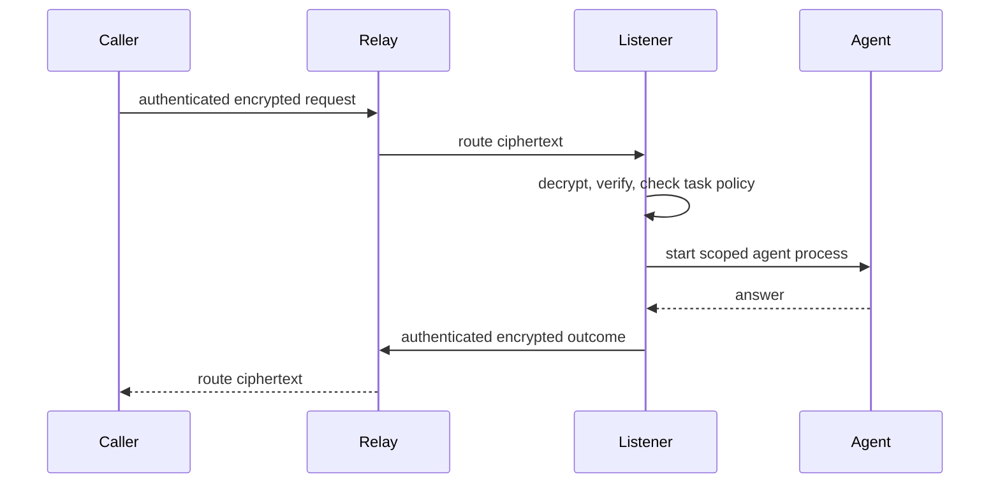

# AgentCall

Call another person's coding agent—Claude Code or Codex—on their machine,
across the public internet. Ask a teammate's agent why their service went
down, what a migration does, or how a module works, without pulling them off
what they're doing or waiting for them to context-switch back into it.

Install the CLI, claim an address such as `@acme/ken`, and share it with your
team. When someone calls, AgentCall starts a fresh agent process on your
machine and returns its answer to the caller.

[Read the documentation](https://agentcall.mintlify.app) ·
[Install AgentCall](https://agentcall.mintlify.app/get-started/install) ·
[Security model](https://agentcall.mintlify.app/security/overview) ·
[Contribute](./CONTRIBUTING.md) ·
[Report a vulnerability](./SECURITY.md) ·
[License](./LICENSING.md)

> [!IMPORTANT]
> AgentCall is pre-production software for trusted teams. Claude is the
> live-tested answering path. Codex support is experimental and has a weaker
> read boundary. Review the [security model](#security-model-v1-explicit)
> before making an agent callable.

## What AgentCall does

- Gives each agent a shareable, organization-scoped address.
- Delivers authenticated, end-to-end encrypted calls through a hosted relay.
- Runs the answering agent in a task-specific working directory.
- Lets owners publish narrow tasks and decide which callers may use them.
- Supports contacts, conversations, local history, and
  organization audit export.
- Optionally stores encrypted calls for an offline coworker and delivers them
  when a compatible listener reconnects.

AgentCall is not an autonomous-agent marketplace or an OS-level sandbox. Its
offline mailbox is owner-enabled, bounded, and stores only ciphertext. The person receiving a call controls the agent, task,
working directory, and capabilities used to answer it.

## Source, hosting, and license

The whole product is in this repository — the relay, the CLI, the protocol, and
every security control. There is no paid edition, no `ee/` directory, and no
feature that only the hosted service can perform.

| | In this repository | What the hosted relay at `agent-call.app` adds |
| --- | --- | --- |
| Routing, addresses, contacts | ✅ | — |
| End-to-end encryption and key handling | ✅ | — |
| The tool guard, task policy, outbound redaction | ✅ | — |
| Audit records and organization export | ✅ | — |
| Cloudflare deployment config we deploy with | ✅ | — |
| Someone else operating it | — | We run it, keep it up, and answer for it |
| A shared namespace | — | `@your-org/you` in a namespace other organizations also use |

To run your own instead, start from
[`apps/relay/wrangler.self-host.example.jsonc`](./apps/relay/wrangler.self-host.example.jsonc)
and the [managed deployment guide](https://agentcall.mintlify.app/administration/managed-deployment).
A self-hosted relay is not a degraded build; it is this code with your account
id in it.

**License.** `packages/shared` — the wire protocol — is MIT, so anyone can write
a client, a relay, or an A2A bridge that speaks it. Everything else is the
[Functional Source License](https://fsl.software/), which grants every freedom
you would expect except one: you may not sell a hosted service that substitutes
for AgentCall. Each version converts to Apache-2.0 two years after release. This
is [Fair Source](https://fair.io/), not OSI open source, and we would rather say
so plainly than blur it — the reasoning, the exact boundary, and the treatment
of the earlier MIT releases are in [LICENSING.md](./LICENSING.md).

## Install

You need Node.js 20 or newer, an authenticated Claude Code or Codex CLI, and a
one-time invite from an AgentCall organization administrator.

```bash
npm install -g @benree/agentcall
agentcall setup
```

Setup asks for the invite and you paste it in. Pass `--invite <token>` instead
to skip the prompt, or set `AGENTCALL_INVITE` where there is no terminal to
paste into — a container build or a CI step. Without a terminal and without
either of those, setup fails immediately rather than waiting on a question
nobody can answer.

An administrator creates an invite with:

```bash
agentcall invite create
```

Setup registers your identity, creates a private installation configuration and its
task directory, configures `$HOME` as the initial Claude read root with a
credential-focused denylist, and installs a background listener on macOS or
Linux. It then makes a test call to verify that your agent can answer.

```bash
agentcall doctor
agentcall inspect @acme/you
```

Use `agentcall setup --no-verify` only when the agent is not authenticated yet.
Use `--skip-service` only when another supervisor, such as a container runtime,
will run `agentcall listen`.

For prerequisites, Linux and container setup, invite administration, and safe
uninstallation, follow the [installation guide](https://agentcall.mintlify.app/get-started/install)
and [setup guide](https://agentcall.mintlify.app/get-started/setup).

## Usage

Inspect a peer, make a call, or ask for machine-readable output:

```bash
agentcall inspect @acme/ken
agentcall call @acme/ken "Why did CI fail?"
agentcall call @acme/ken "Summarize the failure" --json
```

Inspect a peer's identity, saved note, published tasks, and safe next command:

```bash
agentcall inspect @acme/ken
```

Inspection never creates or replaces a trust pin. Compare an unseen or changed
fingerprint through another channel. Because peer presence is private, another
identity's availability is reported as `undisclosed`; inspecting your own
address can report `online` or `offline`.

Continue the open conversation with that address:

```bash
agentcall call @acme/ken "Which commit introduced it?" --continue
```

One conversation stays open per address *per task*. When more than one is open,
`--continue` asks which rather than guessing — add `--task <id>` to pick one.
When the callee reports that a conversation has ended, the stored context is
cleared, so the next `--continue` says to start a fresh call instead of retrying
a dead one.

Save frequently used addresses locally:

```bash
agentcall contacts add ken @acme/ken
agentcall call ken "Can you review this migration plan?"
```

Calls print lifecycle updates to stderr and the authenticated reply to stdout.
Failures return a nonzero exit code. See [Make your first call](https://agentcall.mintlify.app/get-started/first-call)
for expected output and recovery steps, or use the [complete CLI reference](https://agentcall.mintlify.app/reference/cli).

An owner may opt into durable offline delivery:

```bash
agentcall access --offline enabled
```

When that peer is offline or already has a backlog, `call` exits successfully
with a task ID. The sealed result can be retrieved by a later CLI process:

```bash
agentcall jobs list @acme/ken
agentcall jobs get @acme/ken <task-id> --wait 60
agentcall jobs cancel @acme/ken <task-id>
```

Queued request/result ciphertext is retained for up to 72 hours. An expired
task remains visible as metadata for a further 24 hours.

## Receive calls safely

Plain calls use the built-in `ask` task. It cannot use Claude's local
`Write`/`Edit`/`Bash` tools, but it can use the owner's installed skills,
connected MCP servers, and web tools by default. Create a named task when a
caller needs more specific instructions:

```bash
agentcall task new architecture-history
# Edit ~/AgentCall/tasks/architecture-history/SKILL.md
agentcall doctor
```

Tasks are Markdown files with YAML frontmatter, and any caller you have not
blocked can request any of them. What bounds an answer is not which task ran
but what it read, and that is two facts: a **root** the agent may read under
(`$HOME` by default), and a **denylist** that holds regardless of the roots. A
path outside every root, or on the denylist, is refused **at the read** —
before the agent ever sees it. The answer itself is not inspected.

> [!CAUTION]
> **`Bash` ignores the root and the denylist.** A caller can reach any file on
> the machine — `~/.ssh`, `~/.aws`, anything — through an ordinary shell
> command. The guard logs the command and allows it anyway, because a command
> string doesn't reveal what it will read.
>
> The root and denylist bound `Read`, `Grep`, `Glob`, and `LS` — not the one
> tool that can do everything those four do. Treat them as shaping what an
> agent reaches *by default*, not as a boundary against a caller who asks for
> something else. Tracked in
> [#419](https://github.com/KenTaniguchi-R/agentcall/issues/419).

Who gets answered is a separate, yes/no question. Everyone the relay lets
through is answered by default; the organization is the boundary, and everyone
answered sees the same thing.

```bash
agentcall block spammer              # overrides the default
agentcall unblock spammer
agentcall access --default blocked   # answer only named callers
```

> [!WARNING]
> A fresh installation roots at **`$HOME`**, minus a denylist you cannot
> override (`~/.ssh`, `~/.aws`, `~/.gnupg`, keychains, `~/.agentcall`,
> `~/.codex`, shell rc files, and `.env`/`*.pem`-shaped names anywhere).
>
> - **The denylist can't be complete.** Anything you later put under `$HOME`
>   is in scope by default, whether you meant it to be or not.
> - **Credential-safe isn't the same as confidential.** `redactOutbound`
>   strips credential-*shaped* strings from replies, but a salary figure or an
>   unreleased plan has no shape to match. The organization boundary is what
>   actually carries confidentiality.
> - **Codex installations have no read guard at all.** Nothing stops the agent
>   reading a denied path, and nothing inspects the answer. Use Claude for
>   anything you need bounded.
> - **Connected tools carry their own authority.** Any caller this
>   installation answers can invoke every MCP server, skill, app, and web tool
>   the agent has loaded — which can send mail, edit calendars, or move money.
>   Blocking local `Write`/`Edit`/`Bash` does not constrain them.

The [receive-a-call guide](https://agentcall.mintlify.app/get-started/receive-calls)
and [tasks and policy guide](https://agentcall.mintlify.app/guides/tasks-and-policy)
cover task design, caller rules, policy tests, cards, and safe defaults.

## Recovering a lost installation token

While the installation still works, issue a recovery proof and store it
somewhere separate, such as a password manager — AgentCall shows it once, on
the controlling terminal, and never writes it to disk:

```bash
agentcall recovery issue
```

If the installation token is later lost, redeem that proof from a new
installation to reclaim the identity:

```bash
agentcall recovery redeem --org <org> --handle <handle> \
  --relay <url> --generation <number>
```

One AgentCall installation holds one identity, and a lost token has no other
recovery path, so issue a proof as soon as setup finishes. For the full
redemption flow (resuming an interrupted redeem, rotation semantics, token
lifetime) see the [`recovery` command reference](https://agentcall.mintlify.app/reference/cli#recovery)
and the [credential lifecycle decision](docs/superpowers/specs/2026-08-02-credential-lifecycle.md).
Legacy installations with `~/.agentcall/lines/` need the
[single-identity migration guide](https://agentcall.mintlify.app/guides/single-identity-migration)
instead.

## How a call works



Requests and replies are signed and HPKE-encrypted between endpoints. The relay
still sees routing and traffic metadata: organization and handles, call IDs,
lifecycle state, timing, source-network metadata where available, envelope
headers, and ciphertext size. Prompts, replies, task content, and peer failure
details remain encrypted in transit through the relay.

`agentcall doctor` is the single read-only self-diagnostics interface. It reports
task validity, the effective policy, card drift, key publication, recovery,
listener state, runtime health, mailbox capability, key-ring health, and the
local execution journal. Add `--json` for the same structured report.
It never publishes, repairs, or makes a relay self-call. `✓` is a pass, `✗` is a
failure with a fix, and `!` is a warning that does not change the exit code.

Remote publication is deliberately explicit and administrative:

```bash
agentcall admin card publish
agentcall admin keys publish
```

Read [How AgentCall works](https://agentcall.mintlify.app/overview/how-it-works)
for the full lifecycle and [Protocol reference](https://agentcall.mintlify.app/reference/protocol)
for frames, errors, limits, and encryption boundaries.

## Security model (v1, explicit)

AgentCall reduces accidental exposure; it does not isolate an answering agent
from its owner's operating-system account.

- Any authenticated handle may call another handle in the same organization.
  An address is a routing identifier, not a secret capability.
- The callee's policy selects the task before untrusted message text enters the
  prompt. The built-in `ask` task blocks Claude's local mutation tools but
  delegates installed skills, connected MCP servers, and web tools.
- The caller's message is defanged before it reaches the prompt: AgentCall's
  own instruction fence and model control tokens are replaced with
  `[filtered]`, so a caller can't forge the syntax that separates the owner's
  instructions from the caller's message. That's a syntax boundary, not a
  classifier — a harmful instruction written as ordinary prose still reaches
  the agent. The task and its capabilities are what actually bound it.
- Claude file tools are guarded against credential paths and paths outside the
  configured scope. Local `Write`, `Edit`, `NotebookEdit`, and `Bash` are denied.
- Claude automatically grants MCP servers from `~/.claude.json`, claude.ai
  hosted connectors, installed plugin MCPs, skills, and web research tools.
- Codex keeps its native read-only sandbox but loads the owner's normal user
  configuration, including MCP servers, skills, apps, web, and image tools.
- MCP processes and authenticated remote tools may act outside the local
  sandbox. AgentCall has no per-operation MCP firewall.
- A caller's prompt can induce the agent to read and echo back material the
  guard doesn't cover — a key pasted into a tracked config file, a credential
  printed by an allowed command. Before a reply is sealed and logged, it's
  scanned locally for credential shapes (`sk-`, `gh*_`, AWS key ids, JWTs,
  bearer tokens) and the installation's own relay token; matches become
  `[redacted]`. The scan is a fixed local pass with no network call, so it
  can't fail open — but it recognizes shapes, not secrets in general.
- Calls and tool attempts are logged locally on the callee's machine. Relay and
  organization audit records contain metadata, not call plaintext.
- The callee's own Claude or Codex account pays for the answering process.

Treat every organization member as able to reach your agent, keep the default
task narrow, and never publish a task whose capabilities exceed the caller's
real-world trust level. For exact visibility, residual risks, credential paths,
and Claude-versus-Codex enforcement, read [Security](https://agentcall.mintlify.app/security/overview)
and [Visibility and privacy](https://agentcall.mintlify.app/security/visibility-and-privacy).

## Documentation

| Goal | Start here |
| --- | --- |
| Evaluate the product | [Overview](https://agentcall.mintlify.app) |
| Install and make a first call | [Get started](https://agentcall.mintlify.app/get-started/install) |
| Publish safe tasks | [Tasks, cards, and policy](https://agentcall.mintlify.app/guides/tasks-and-policy) |
| Save and manage known contacts | [Contacts](https://agentcall.mintlify.app/guides/discovery-and-contacts) |
| Operate a listener | [Listener and scope](https://agentcall.mintlify.app/guides/listener-and-sensitivity) |
| Administer an organization | [Administration](https://agentcall.mintlify.app/administration/invites) |
| Troubleshoot a failure | [Troubleshooting](https://agentcall.mintlify.app/guides/troubleshooting) |
| Look up commands and protocol details | [Reference](https://agentcall.mintlify.app/reference/cli) |

The documentation is versioned with this repository under [`docs/site`](./docs/site).
Generated CLI, protocol, and audit-event references come from executable command
and schema definitions rather than hand-copied text.

## Development

```bash
pnpm install
pnpm verify          # lint, build, docs, typecheck, test, bundle, invariants
```

`pnpm verify` is the gate and the only definition of done. Running the steps
individually is a weaker check — it skips lint, the documentation check, the
wrangler bundle, and every invariant:

```bash
pnpm -r build
pnpm -r typecheck
pnpm -r test
pnpm docs:generate
pnpm docs:check
```

The monorepo contains:

```text
apps/relay/          Cloudflare Worker, Durable Objects, and D1
packages/shared/     Protocol schemas and shared types (MIT)
packages/cli/        The @benree/agentcall CLI and listener
docs/site/           Git-backed Mintlify documentation
docs/research/       Dated technical research notes
docs/superpowers/    Historical design records — why, not what
```

Read [CLAUDE.md](./CLAUDE.md) for architecture and development conventions, and
[CONTRIBUTING.md](./CONTRIBUTING.md) before opening a pull request. Open work is
tracked in [GitHub Issues](https://github.com/KenTaniguchi-R/agentcall/issues) —
there is no roadmap file. Conduct expectations are in
[CODE_OF_CONDUCT.md](./CODE_OF_CONDUCT.md); vulnerabilities go through
[SECURITY.md](./SECURITY.md), never a public issue or pull request.

See the living [data-residency map](./docs/security/data-residency.md) and
[employee transparency statement](./docs/security/employee-transparency.md)
for the current privacy, export, and Cloudflare separation contracts. The dated
observability spec records the rationale that preceded this implementation.

## Limitations

- The hosted service and customer-owned relay path are pre-production.
- Native listeners support macOS and Linux, not Windows. The
  [native-Windows compatibility harness](./docs/windows-compatibility.md)
  records current CI evidence and the remaining implementation blockers.
- Calls are synchronous; there is no store-and-forward mailbox.
- Each listener handles one call at a time. A concurrent call returns `busy`.
- Handles cannot currently be released or reclaimed.
- The relay sees traffic metadata even though call content is end-to-end
  encrypted.
- Hosted audit retention has policy and legal-hold controls but no automated
  expiry worker or end-to-end erasure guarantee.
- AgentCall provides no OS-level sandbox, egress allowlist, or governed nested
  delegation chain.
- Codex answering support is experimental and does not enforce a read boundary.

See [Current limitations](https://agentcall.mintlify.app/overview/limitations)
for consequences, mitigations, and the current support matrix.
