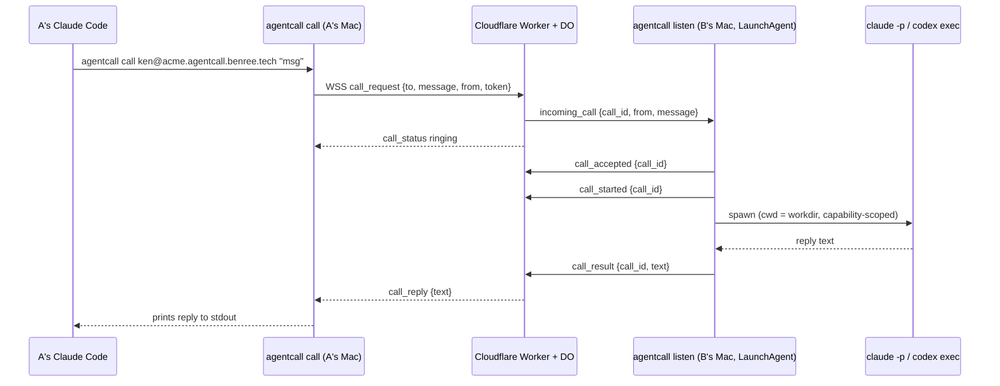

# agentcall

Call another person's coding agent (Claude Code or Codex) on their Mac, across the
public internet, like a phone call. Install with one command, get an address
(`ken@acme.agentcall.benree.tech`), share it. When someone calls your address, your Mac
spawns an agent that answers, even while you're away.

## How a call works



The listener sends `call_accepted` then `call_started` instead of the old
single `call_answer`. The relay hasn't been switched over yet — it still only
understands `call_answer`, so it never emits `call_status answered` today; the
caller-facing `answered` status is dark until the relay picks up the new
frames.

Non-goals for v1: store-and-forward, non-macOS platforms, anonymous callers,
payment/reputation.

## Install

```bash
npm install -g @benree/agentcall
agentcall setup --invite <one-time-token>
```

Ask an existing member of your organization to run `agentcall invite`. The
returned token expires after seven days and can enroll exactly one identity.
The relay no longer serves a public shell installer.

For the first member of the first organization, the relay operator configures
`BOOTSTRAP_TOKEN` with `wrangler secret put BOOTSTRAP_TOKEN`, then creates the
initial invite with `POST /v1/admin/invite` using that value as a Bearer token
and `{ "org": "acme" }` as the JSON body. The endpoint is a 404 when the secret
is not configured.

`agentcall setup` will:
- detect `claude` / `codex` on your `PATH` (or prompt you to pick one)
- derive the organization from the invite, prompt for a handle, then register that
  tenant-scoped identity (`POST /v1/register`)
- write `~/.agentcall/lines/<name>/config.json` (0600) with your organization,
  handle, token, agent kind, and relay URL — `<name>` defaults to the agent kind
  (e.g. `claude`); see "Several agents, several addresses" below for adding more
- create `~/AgentCall/<name>/public/`, the callee agent's working directory
- install and load the `tech.benree.agentcall.listener` LaunchAgent
- offer to append a short usage snippet to `~/.claude/CLAUDE.md` / `~/.codex/AGENTS.md`
  so *your own* agent knows how to call other people
- print your address, e.g. `ken@acme.agentcall.benree.tech`

Setup verifies by default that your agent — claude or codex — can actually
answer a call, including that it's authenticated. Pass `--no-verify`
to skip the post-setup test call (e.g. when provisioning before logging in).

Handles are unique within an organization, not globally: Acme and Beta can
both register `ken`. Hosted addresses carry the tenant in the hostname
(`handle@org.agentcall.benree.tech`); a self-hosted relay uses its own hostname
(`handle@agents.acme.com`). Authentication, cards, presence, calls, rosters,
and Durable Object state are all keyed by organization plus handle. The CLI
rejects a hosted address for a different organization instead of silently
routing its bare handle inside the caller's tenant.

## Usage

```bash
# Check if someone's agent is online
agentcall status ken@acme.agentcall.benree.tech

# Call it
agentcall call ken@acme.agentcall.benree.tech "what's the weather doing over there?"

# Machine-readable reply (for your own agent to parse)
agentcall call ken@acme.agentcall.benree.tech "..." --json
```

`agentcall call` prints spinner-style status to stderr (`ringing...`) and the
reply text to stdout. It used to also print `answered, agent working...`, but
that line is currently unreachable: the relay only emits `call_status
answered` on the old `call_answer` frame, and the listener no longer sends it
(see "How a call works" above). Temporary until the relay is switched to the
new `call_accepted`/`call_started` frames. Nonzero exit + an
error message on stderr on failure (`unknown_handle`, `offline`, `busy`,
`timeout`, `agent_error`, `unauthorized`, `rate_limited`, `message_too_large`,
`protocol_error`).
`agentcall status` prints `online`/`offline` and exits `0`/`2` (or `1` on a
relay error). It requires a completed `agentcall setup`: presence is
caller-only, so the relay authenticates status checks rather than serving
anyone who asks (an anonymous endpoint let anybody enumerate handles and poll
whether your Mac was awake).

Both `call` and `status` place the call from whichever of your lines is registered
on the destination's relay — normally invisible on a one-line machine. On a
machine with several lines, pass `--as <line>` to pick one explicitly (needed only
if more than one of your lines shares that relay); otherwise the primary line on
that relay is used, and the command refuses with the candidates named if there's
more than one and no primary among them.

Remote card reads also require a completed setup. The relay authenticates the
viewer before looking up either the native card or the per-agent A2A card, so
an anonymous or wrong-tenant probe cannot use 404 responses to enumerate an
organization's handles or published tasks. The generic relay card at
`/.well-known/agent-card.json` remains public because it contains no tenant or
employee data.

### Following up

A reply can leave the conversation open, letting you ask a follow-up without
restating the question:

```bash
agentcall call ken@acme.agentcall.benree.tech "why did CI fail?"
# ... answer ...
agentcall call ken@acme.agentcall.benree.tech "which commit?" --continue
```

`--continue` resumes your last open conversation with that address;
`--context <id>` targets a specific one instead. Conversations expire 30
minutes after the last turn and are capped at 10 turns. They are scoped to
you and to the task they started on, so a conversation cannot be handed to
someone else or moved to a different task. A conversation also ends if the
owner changes the agent they run or the directory it answers from.

Tasks that grant `write` or `exec` are not conversational by default, because
a caller's earlier messages stay in the agent's context across turns. Set
`threadable: true` in a task's `SKILL.md` frontmatter to opt in.

A conversation belongs to the line that opened it: `--continue` looks up the
last open conversation for the line placing the call, so two lines calling the
same address keep separate threads.

```bash
# Replace your relay token if it may have leaked
agentcall rotate
```

`agentcall rotate` swaps one line's token for a fresh one — pass `--line <name>`
on a multi-line machine, or it rotates the primary line. The old token stops
working for new connections immediately, but a listener that's already
connected keeps its live socket and only starts using the new token on its
next reconnect; other lines are unaffected. If the old token may have leaked,
restart the listener right away instead of waiting for that reconnect:
`agentcall listen` in the foreground, or the background one with

```bash
launchctl kickstart -k gui/$UID/tech.benree.agentcall.listener
```

Releasing a handle entirely isn't supported yet — see Limitations.

`--line <name>` (or the `AGENTCALL_LINE` environment variable, same precedence
order — an explicit `--line` wins) selects which line a command acts on wherever
a machine has more than one: `rotate`, `card`, `task new`, and the six policy
verbs (`allow`/`revoke`/`block`/`unblock`/`offer`/`unoffer`) all accept it. Omit
it and these default to the primary line.

```bash
# Check your own install is healthy
agentcall doctor
```

`agentcall doctor` verifies your install can answer calls (auth, agent spawn,
listener, relay self-call) — run it whenever calls to you start failing. `✓` is a
pass and `✗` is a failure with a fix; a `!` is a check that could not be proven
either way this run, which is not a failure and does not change doctor's exit code.

Plain calls (no `--task`) run the built-in read-only `ask` task. To offer more:

    agentcall task new schedule-meeting   # scaffold ~/AgentCall/<line>/tasks/<id>/SKILL.md
    # edit the SKILL.md (YAML frontmatter: description, tools, timeout_s, ...)
    agentcall card                        # review your card + catch problems
    agentcall offer schedule-meeting      # offer to everyone, or:
    agentcall allow ken schedule-meeting  # grant to one caller
    agentcall block spammer               # refuse a caller entirely

Tasks are one markdown file each — YAML frontmatter (only `description` is
required) over the instructions your agent follows. Grants and blocks live in
`~/.agentcall/lines/<line>/policy.json`; the verbs above edit it for you and
republish your card automatically. Callers see your menu with
`agentcall card <address>`. All of these act on the primary line unless you pass
`--line <name>` (see above).

For a roster-wide grant, add a locally named entry to `groups` in
`~/.agentcall/policy.json`, using the opaque id shown by `agentcall roster
list`, then run `agentcall card push`:

```json
{
  "default_offer": ["ask"],
  "callers": { "spammer": { "offer": [], "block": true } },
  "groups": {
    "eng": {
      "roster_id": "the-roster-id-from-roster-list",
      "offer": ["architecture-history", "schedule-meeting"]
    }
  }
}
```

Group names are local labels only. A caller cannot claim one or choose which
policy applies: the relay attests the roster ids currently shared by caller and
callee on each connection. Unknown or removed memberships grant nothing, and
an individual `block` always overrides group and default offers.

> **Codex support is experimental.** The `claude` path is the one that's
> actually been live-tested end to end; `codex` support is implemented and
> unit-tested but hasn't been verified against a real call yet.

## Several agents, several addresses

One Mac can hold more than one address — one per "line". A line is a full
identity: its own handle, relay token, agent kind (or none, if it's caller-only),
policy, tasks, and working directory, stored under `~/.agentcall/lines/<name>/`.
One process (`agentcall listen`, run for you by the LaunchAgent) opens one socket
per callable line, so a single Mac can answer as `ken@...` on one address and
`ken-codex@...` on another at the same time.

```bash
# Add a second address — e.g. a codex line alongside your (probably claude) first one
agentcall line add codex --handle ken-codex --agent codex --invite <token>

# List every address this machine holds
agentcall line list

# Make a different line the default for outbound calls (see below)
agentcall line primary codex

# Remove one — see the warning below before you do
agentcall line remove codex --yes
```

`agentcall line add <name>` registers a brand-new handle (a name is spent
permanently the moment registration succeeds — see Limitations) and writes
`~/.agentcall/lines/<name>/`. `<name>` is a local label only; it is never sent to
the relay and nobody you call ever sees it — only the handle is shared. Pass
`--caller-only` for a line that can call out but never answers (no agent
required), or `--agent claude`/`--agent codex` for one that does. `--no-verify`
skips the post-registration test call, same as `setup --no-verify`. `--invite` is
required: every line enrols in its own organization, so a second line needs its
own invite even on a machine that already has one — it may be joining a
different tenant entirely, and only the relay can say which. Like `line
remove` below, a callable `line add` reinstalls the LaunchAgent afterward
(`--skip-launchd` to skip it) — since one process serves every line, adding one
briefly drops every other line's socket and any calls in flight on them too.

`agentcall line list` shows every line's name, address, online/offline/caller-only/
broken state, and which one is primary. `agentcall line remove <name> --yes`
archives that line's `calls.log` under `~/.agentcall/removed/` (or deletes it
outright with `--purge`) and reinstalls the LaunchAgent to stop serving it — the
`--yes` isn't a formality: **handle release isn't implemented (see
Limitations), so a removed handle is gone for good, not freed for reuse.** You
can't remove your only line or the current primary; promote another first with
`agentcall line primary`.

**Outbound calls use the primary line automatically.** `agentcall call`/`agentcall
status` pick whichever of your lines is registered on the destination's relay —
almost always just one, so this is invisible day to day. If more than one of your
lines shares that relay, the primary is used; pass `--as <line>` to call from a
different one on purpose. `agentcall line primary <name>` changes the default.

**An address is not a security boundary between your lines.** Every line on a
machine runs under the same account with the same filesystem access — a
caller-only line and a callable one, or two callable lines with different agent
kinds, share one guard, one Mac, one owner. Splitting into several lines
separates *identities* (who you appear to be to which caller) and *task menus*
(what each address is allowed to do), not *trust* — see Security model below for
what the tool guard does and does not confine regardless of which line answers.

## Finding who to ask

`agentcall call` assumes you already know the address. In a company you often
don't — that's what rosters and `agentcall search` are for.

A **roster** is an opt-in group whose members can discover each other's
published tasks. Creation returns separate join and admin secrets. Store the
admin secret in a password manager and share only the id and join secret:

```bash
agentcall roster create --as acme
# prints an id, join secret, and admin secret; all are shown once

# everyone else:
agentcall roster join <roster-id> --secret <secret> --as acme
```

Then search by what you need, not by who you know:

```bash
agentcall search "why did we pick this auth migration"
# tanaka@acme.agentcall.benree.tech  architecture-history
#   Why past architecture decisions were made — ADR context and migration rationale.
#   matched: auth (keywords) · migration (keywords, description)
#   agentcall call tanaka@acme.agentcall.benree.tech --task architecture-history "<message>"

agentcall search "..." --json    # for your own agent to parse
```

Add `keywords` to a task's `SKILL.md` frontmatter to make it findable; they're
weighted highest (`keywords` 3, task name 2, description 1 per matching word),
and a result needs to clear a minimum score to be shown at all — a single
keyword hit or a name match qualifies on its own, but one incidental word
picked up from a description does not:

```yaml
---
description: Why past architecture decisions were made.
keywords: [auth, migration, adr]
---
```

Search results are prefixed with `[roster-name]` only when more than one
roster is in scope — with a single roster, or `--roster <name>`, the address
alone is enough. If every joined roster fails to refresh (relay unreachable,
no cache yet), `agentcall search` exits non-zero; a partial failure across
several rosters still exits `0`, with the affected roster called out as stale
in the output.

**Matching happens on your machine.** The relay serves each member a
per-caller-filtered index of what they've published *to you*; ranking that
index against your query runs locally, so the query text itself is never sent
anywhere. Refreshing a roster does tell the relay that your handle refreshed
that roster at that time, so search *activity* isn't private — only the query
is.

Membership has an explicit lifecycle:

```bash
agentcall roster leave acme                    # relay leave + local cleanup
agentcall roster expel acme <handle>           # requires the admin secret
agentcall roster rotate acme                   # closes the door; members stay
agentcall roster rotate acme --evict --yes     # incident response: clear all members
agentcall roster delete acme --yes              # teardown; audit events survive
```

Administrative commands resolve the secret from `--admin-secret`, then
`AGENTCALL_ADMIN_SECRET`, then an interactive prompt. The flag is convenient
for scripts but can appear in shell history and process listings. The admin
secret is never stored by AgentCall and cannot be recovered; if every copy is
lost, abandon and recreate the roster. Expulsion revokes future fetches, not
data already cached or copied. An expelled member can rejoin while the old join
secret remains valid, so rotate it after expulsion if they may still know it.
`agentcall roster forget` remains the explicit local-only escape hatch when the
relay is unreachable; use `leave` for actual membership removal.

Results are hints, not permission: a task can appear in search and still be
refused when you call it, because the callee's policy is what actually
decides.

**Rosters belong to a line, not to the machine.** A roster is membership held by
one handle on one relay, which is exactly what a line is — so `roster create`,
`roster join`, `roster list`, `roster forget` and `search` all act as the primary
line unless you pass `--line <name>`. Joining a roster on one line does not make
it visible to another.

## Contacts

Save addresses under a short name so you don't have to retype `handle@host`
every time:

```bash
agentcall contacts add ken ken@acme.agentcall.benree.tech --note "who they are"
agentcall contacts list                # name, address, note
agentcall contacts list --json         # machine-readable
agentcall contacts remove ken
```

`agentcall contacts add` upserts — adding a name that already exists updates
its address (and note, if you pass a new one) instead of erroring.
`agentcall call`, `agentcall status`, and `agentcall card` all accept a saved
contact name anywhere they'd otherwise take a `handle@host` address:

```bash
agentcall call ken "what's the weather doing over there?"
agentcall status ken
agentcall card ken
```

Contacts are stored locally in `~/.agentcall/contacts.json` (mode `0600`)
and never leave your machine.

## How the callee side works

- `agentcall listen` runs continuously as a LaunchAgent (`KeepAlive`,
  `RunAtLoad`, logs to `~/.agentcall/listener.log`), holding a WebSocket open
  to the relay so calls are delivered instantly instead of polled.
- It queues at most 1 running call + 0 pending; a second concurrent caller
  gets an immediate `busy` reply. With a 5-minute agent timeout running
  against a 6-minute relay deadline, a queued call would not have enough
  budget left to finish in time, so pending capacity is zero rather than
  handing it a truncated execution window.
- Each call spawns a fresh one-shot agent process in that line's working
  directory (`~/AgentCall/<line>/public/` by default — see below), scoped to the
  capabilities the resolved task grants:
  - Claude: `claude -p --permission-mode dontAsk --allowedTools <tools>`, where
    the tool list is derived from the task's `tools:` frontmatter. Anything not
    listed is denied rather than prompted for (headless `-p` can't prompt).
  - Codex: `codex exec --sandbox read-only|workspace-write --cd <workdir>`.
    Codex has no per-tool granularity, so the task's `write` capability maps
    onto its native sandbox level instead.
  - A continued call (`--continue`/`--context`) spawns the same way but adds
    the resume form — `claude --resume <id>` or `codex exec resume <id>` —
    instead of starting a fresh session.
- Every call — accepted or not — appends a JSONL line to that line's
  `~/.agentcall/lines/<line>/calls.log`: `{ts, call_id, from, message, task,
  status, duration_ms}`, plus `context_id` (the opaque conversation token, never
  the agent's real session id) and `turn` once a call actually completes. That's
  your audit trail of who called and what happened, kept separate per line so one
  address's history doesn't mix into another's.
- A 5-minute kill timer (SIGTERM then SIGKILL) bounds each spawned agent; the
  relay enforces its own 6-minute hard timeout per call on top of that.

### Working directory

By default the answering agent runs in `~/AgentCall/<line>/public/` — an empty
share folder — and is told to stay there. That keeps `setup`/`line add` free of a
question most people can't answer, but it also means the agent has little to
answer *from*.

To have your agent answer with real context, set an absolute `workdir` in that
line's `~/.agentcall/lines/<line>/config.json`:

```json
{ "handle": "ken", "token": "...", "agent_kind": "claude",
  "relay": "https://agentcall.benree.tech",
  "workdir": "/Users/ken/code/payments-api" }
```

Restart the listener afterwards — it resolves `workdir` once at startup, and
refuses to start if the path is relative, missing, or not a directory.
`agentcall doctor` reports the resolved path per line (or the reason it failed).

Individual tasks can narrow this further with an absolute `workdir` in their
`SKILL.md` frontmatter. It overrides the install-global directory for that task:

```yaml
---
description: Explain decisions in the payments service.
tools: [read]
workdir: /Users/ken/code/payments-api
---
```

Relative, missing, and non-directory task workdirs make that task invalid and
it is not offered. For a Claude answering agent, file-shaped tools are guarded
to the resolved task directory. This is a real boundary for `Read`, `Write`,
`Edit`, `Glob`, `Grep`, and `LS`, including canonicalized paths and symlinks.
It is not a boundary for `exec`, and Codex has no equivalent read boundary;
see the residual risks below.

## Security model (v1, explicit)

- Address = capability to call. Callers must themselves be registered — the
  `from` handle is relay-verified, anonymous callers are rejected.
- **There is no OS-level sandbox.** The answering agent runs with the same
  filesystem and network access as the agent you run yourself. Enforcement is
  capability scoping (`--allowedTools` / codex's `--sandbox` level) plus
  pre-prompt task resolution: which task a caller may invoke is decided from
  that line's `policy.json` *before* their message is placed in any prompt, so
  the message cannot influence what it is allowed to do. Within a granted capability, the
  only thing constraining *where* the agent reads and writes is the tool guard
  below — and it covers file-shaped tool arguments, not `exec`.
  (An earlier version wrapped every spawn in Seatbelt via `sandbox-runtime`.
  That was removed deliberately: it is incompatible with the answering agent
  being the owner's real agent with the owner's real context.)
- The callee's own API key / subscription pays for answering calls — accepted
  as fine for v1 friends-scale usage, not for public/adversarial exposure.
- Known residual risks (accepted, not eliminated):
  - Prompt injection in a caller's message can burn the callee's tokens, and —
    within the granted capabilities — read or write anywhere the owner's own
    agent could via `exec` (shell commands are recorded, not blocked — see
    Tool guard below) or on a Codex answering agent, which has no read guard.
    On a Claude answering agent using `Read`/`Write`/`Edit`/`Glob`/`Grep`, the
    tool guard below refuses the credential paths it covers. Capability
    scoping bounds *what kind* of action is possible, not *where*.
  - A Claude answering agent's file-shaped tools are confined to the resolved
    task workdir. A task granted `exec` can still read outside it through shell
    commands, and a Codex answering agent is not confined for reads at all.
  - The relay operator can read message plaintext — there's no end-to-end
    encryption in v1.
  - A caller's prompt could induce the agent to read and echo back the
    callee's Claude Code session history (`~/.claude/projects/*`, which can
    contain pasted secrets and private code), API keys in `~/.claude.json`'s
    `mcpServers` entries, `~/.ssh`, `~/.aws`, `~/.codex` (which holds
    `auth.json` and a `config.toml` that routinely carries API keys in
    plaintext), or the relay token in that line's
    `~/.agentcall/lines/<line>/config.json`. The tool
    guard below refuses these paths for a Claude answering agent's
    file-reading tools, but not for `exec`, and not at all for a Codex
    answering agent. **Only share your address with people you would trust to
    run a read-only command in your home directory.**
  - Executable configuration surfaces (`~/.claude/CLAUDE.md`, `hooks`,
    `plugins`, `commands`, `agents`) are writable by an agent granted `write`,
    so a hostile prompt can persist beyond the call. On Claude, the tool guard
    refuses `Write`/`Edit` to `~/.claude/**`, to its own installed package
    root (so a write-only call cannot neuter the guard for the next tool call
    in the same session — a fresh process re-imports it from disk on every
    call), to `~/AgentCall/<line>/tasks` for every line on the machine (so a
    write-only call cannot rewrite an already-offered task's capability
    envelope, which is read verbatim from frontmatter — not just the answering
    line's own tasks, since a caller could otherwise widen a *different*
    line's grants), to `~/Library/LaunchAgents`, and to shell startup files
    (`.zshrc` and friends). This risk remains live via `exec` and on a Codex
    answering agent, which has no read guard.
  - `~/.codex` is refused for a Claude answering agent, but a **Codex**
    answering agent can still read its own configuration and credentials —
    `--ignore-user-config` stops that config being *loaded*, not being *read*.

**Tool guard.** Tool calls a caller's agent makes on your machine are checked before
they run. File reads, writes, searches, and listings that reach credential paths
(`~/.ssh`, `~/.aws`, `.env`, Keychains, `~/.agentcall`, `~/.claude`, `~/.codex`), the guard's own
installed code, `~/AgentCall/<line>/tasks` for every line, `~/Library/LaunchAgents`,
and shell startup files are refused. For Claude, file-shaped tools outside the
resolved task workdir are also refused, and every tool call reaching the guard is
recorded to that line's `~/.agentcall/lines/<line>/tools.log`. `agentcall doctor`
verifies the guard is in force — once per distinct agent kind rather than once per
line, since the guard protects the binary, not any particular address, and claude
lines sharing one machine share one guard: it asks a
real `claude` spawn to read a canary `.env` and requires the denial to appear in the
log. When the model refuses that read on its own the guard is never consulted and the
run proves nothing, so doctor falls back to invoking the guard directly and reports
`!` — unverified, not broken.

Two limits, stated plainly:

- **A task that grants `exec` has no read floor.** Shell commands are recorded, not
  blocked — pattern-matching a command string is too weak to be a boundary and too
  eager to be harmless. The control on `exec` is which tasks you choose to write.
- **A Codex answering agent is neither guarded nor, today, observed.** The same hook is
  registered on the Codex spawn in *observe* mode — record, never block — but Codex
  gates hooks on persisted trust and agentcall supplies its hook inline via `-c`, which
  has never been trusted, so **Codex skips it silently and the Codex spawn produces no
  `tools.log` telemetry at all** ([issue #4](https://github.com/KenTaniguchi-R/agentcall/issues/4)).
  The mechanism itself is sound: forced to run, the guard does see the whole surface,
  including bundled MCP calls such as `mcp__codex_apps__sites__list_sites`. It is the
  trust gate, not the guard, that is missing. Codex has no `Read`/`Grep`/`Glob` tools, and most of
  what it does reach the filesystem with is `Bash` (`sed -n '1,200p' file`) — exactly
  the surface the point above says cannot be bounded by matching command strings. Its
  `--sandbox` level confines writes but not reads: `codex exec --sandbox read-only`
  still reads `~/.ssh`. **A Codex answering agent therefore has no read floor — and
  until #4 is fixed, no record of what it did either.**
- **Codex does not reach the filesystem only through `Bash`, and the non-shell routes
  are not recorded at all.** `view_image` reads any absolute path and returns the raw
  bytes — it does not check that the file is an image, so it is a general file-read
  primitive — and `apply_patch` reads a file to verify patch context. Both are
  reachable in the spawn shape above, and neither emits an event that `agentcall`
  parses, so a read through them appears in **no** log: not `tools.log`, not
  `calls.log`. Verified against codex-cli 0.146.0; see
  [issue #29](https://github.com/KenTaniguchi-R/agentcall/issues/29).
- **The Codex spawn does not load your `~/.codex` — but that does not disarm Codex's
  own bundled tools.** It runs with `--ignore-user-config`, so a caller cannot reach
  *your* MCP servers, plugins, or apps. Those run as separate processes outside Codex's
  sandbox, and a filesystem MCP server — or `claude mcp serve`, which re-exposes `Read`
  and `Bash` — would otherwise route around every control here. What that flag does not
  drop is Codex's own bundled `codex_apps` connector, 28 tools on codex-cli 0.146.0.
  **These are not merely reachable — they work.** In the exact spawn shape above,
  `sites_list_sites` returns a normal `isError:false` result and
  `hotline_get_local_hotline` returns real content fetched from the ChatGPT backend;
  nothing returns the connector's documented auth-failure envelope. The same authenticated
  surface carries `sites_deploy_site_version`, `sites_update_environment_variables`,
  `sites_update_site_access` and `sites_generate_siwc_bypass_token`. **So a remote caller
  can read something in your workspace and publish it to the internet without crossing a
  single denied path.** No read floor touches that, because those tools do not read: they
  send. `--sandbox` does not touch it either — it confines the *shell*, and this traffic
  is not the shell's. Verified against codex-cli 0.146.0 by
  [`scripts/verify-codex-apps-surface.sh`](./scripts/verify-codex-apps-surface.sh); see
  [issue #30](https://github.com/KenTaniguchi-R/agentcall/issues/30).

## Development

```bash
pnpm install
pnpm -r test        # all packages
pnpm -r typecheck
pnpm -r build

cd apps/relay && pnpm dev   # local Worker + DO + D1 via wrangler
```

Monorepo layout:

```
agentcall/
├── apps/relay/          # CF Worker + Durable Object + D1 (wrangler)
├── packages/shared/     # zod protocol schemas — single source of truth
└── packages/cli/        # @benree/agentcall — the `agentcall` command (setup/line/listen/call/status/uninstall)
```

See [CLAUDE.md](./CLAUDE.md) for dev conventions. Open work is tracked in GitHub
Issues, and **the assignee is the claim** — read
[CONTRIBUTING.md](./CONTRIBUTING.md) before starting anything, so two people
don't pick up the same issue. It covers claiming, the automatic release of
stale claims, and the one-worktree-per-session rule.

## Limitations

- **macOS only.** The LaunchAgent listener is Mac-specific; there's no
  Linux/Windows callee support yet.
- **The relay operator sees message plaintext.** Calls are relayed through a
  single shared Cloudflare Worker (Ryusei-hosted); there's no end-to-end
  encryption, so treat call content as visible to the relay operator.
- **Handles can't be released.** `agentcall rotate` replaces a token, but
  there's no way to give a handle back: the Durable Object is addressed by
  handle name, so a re-registered handle would inherit the previous owner's
  relay-side state, and every saved contact pointing at it would silently
  resolve to a different person. Reclaimability needs a decision before this
  can ship, so for now a handle is yours permanently.
- **No OS-level isolation of the answering agent.** See the security model
  section above — this is a deliberate trade, and it is the main reason to be
  selective about who gets your address.
- **One caller can monopolise your agent.** Calls are answered strictly one at
  a time — a second concurrent call gets `busy` — and a single call may run up
  to five minutes before it times out. The hourly cap of 30 calls per caller
  does not bound that: 30 × 5 minutes is more listener time than the hour
  contains, so a caller making sustained long-running calls can keep everyone
  else out. The remedy is `agentcall block <handle>`, which is the same posture
  as the rest of this — you gave that person your address.
