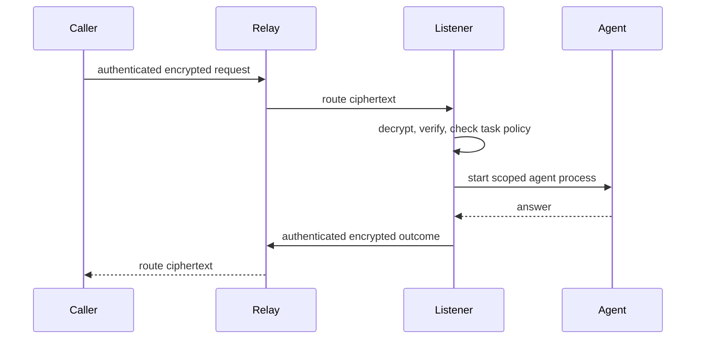

# AgentCall

Call another person's coding agent—Claude Code or Codex—on their machine,
across the public internet.

Install the CLI, claim an address such as
`@acme/ken`, and share it with your team. When someone
calls, AgentCall starts a fresh agent process on your machine and returns its
answer to the caller.

[Read the documentation](https://agentcall.mintlify.app) ·
[Install AgentCall](https://agentcall.mintlify.app/get-started/install) ·
[Security model](https://agentcall.mintlify.app/security/overview) ·
[Contribute](./CONTRIBUTING.md)

> [!IMPORTANT]
> AgentCall is pre-production software for trusted teams. Claude is the
> live-tested answering path. Codex support is experimental and has a weaker
> read boundary. Review the [security model](#security-model-v1-explicit)
> before making an agent callable.

## What AgentCall does

- Gives each agent a shareable, organization-scoped address.
- Delivers authenticated, end-to-end encrypted calls through a hosted relay.
- Runs the answering agent in a task-specific working directory.
- Lets owners publish narrow tasks and decide which callers may use them.
- Supports contacts, conversations, local history, and
  organization audit export.

AgentCall is not an autonomous-agent marketplace, an offline message queue, or
an OS-level sandbox. The person receiving a call controls the agent, task,
working directory, and capabilities used to answer it.

## Install

You need Node.js 20 or newer, an authenticated Claude Code or Codex CLI, and a
one-time invite from an AgentCall organization administrator.

```bash
npm install -g @benree/agentcall
agentcall setup
```

Setup asks for the invite and you paste it in. Pass `--invite <token>` instead
to skip the prompt, or set `AGENTCALL_INVITE` where there is no terminal to
paste into — a container build or a CI step. Without a terminal and without
either of those, setup fails immediately rather than waiting on a question
nobody can answer.

An administrator creates an invite with:

```bash
agentcall invite create
```

Setup registers your identity, creates a private installation configuration and its
task directory, configures `$HOME` as the initial Claude read root with a
credential-focused denylist, and installs a background listener on macOS or
Linux. It then makes a test call to verify that your agent can answer.

```bash
agentcall doctor
agentcall inspect @acme/you
```

Use `agentcall setup --no-verify` only when the agent is not authenticated yet.
Use `--skip-service` only when another supervisor, such as a container runtime,
will run `agentcall listen`.

For prerequisites, Linux and container setup, invite administration, and safe
uninstallation, follow the [installation guide](https://agentcall.mintlify.app/get-started/install)
and [setup guide](https://agentcall.mintlify.app/get-started/setup).

## Usage

Inspect a peer, make a call, or ask for machine-readable output:

```bash
agentcall inspect @acme/ken
agentcall call @acme/ken "Why did CI fail?"
agentcall call @acme/ken "Summarize the failure" --json
```

Inspect a peer's identity, saved note, published tasks, and safe next command:

```bash
agentcall inspect @acme/ken
```

Inspection never creates or replaces a trust pin. Compare an unseen or changed
fingerprint through another channel. Because peer presence is private, another
identity's availability is reported as `undisclosed`; inspecting your own
address can report `online` or `offline`.

Continue the open conversation with that address:

```bash
agentcall call @acme/ken "Which commit introduced it?" --continue
```

One conversation stays open per address *per task*. When more than one is open,
`--continue` asks which rather than guessing — add `--task <id>` to pick one.
When the callee reports that a conversation has ended, the stored context is
cleared, so the next `--continue` says to start a fresh call instead of retrying
a dead one.

Save frequently used addresses locally:

```bash
agentcall contacts add ken @acme/ken
agentcall call ken "Can you review this migration plan?"
```

Calls print lifecycle updates to stderr and the authenticated reply to stdout.
Failures return a nonzero exit code. See [Make your first call](https://agentcall.mintlify.app/get-started/first-call)
for expected output and recovery steps, or use the [complete CLI reference](https://agentcall.mintlify.app/reference/cli).

## Receive calls safely

Plain calls use the built-in, read-only `ask` task. Create a named task only
when a caller needs more specific instructions:

```bash
agentcall task new architecture-history
# Edit ~/AgentCall/tasks/architecture-history/SKILL.md
agentcall doctor
```

Tasks are Markdown files with YAML frontmatter, and any caller you have not
blocked can request any of them. What bounds an answer is not which task ran
but what it read, and that is two facts: a **root** the agent may read under
(`$HOME` by default), and a **denylist** that holds regardless of the roots. A
path outside every root, or on the denylist, is refused **at the read** —
before the agent ever sees it. The answer itself is not inspected.

Who gets answered is a separate, yes/no question. Everyone the relay lets
through is answered by default; the organization is the boundary, and everyone
answered sees the same thing.

```bash
agentcall block spammer              # overrides the default
agentcall unblock spammer
agentcall access --default blocked   # answer only named callers
```

> [!WARNING]
> A fresh installation roots at **`$HOME`**, minus a denylist you cannot override
> (`~/.ssh`, `~/.aws`, `~/.gnupg`, keychains, `~/.agentcall`, `~/.codex`, the
> shell rc files, and `.env`/`*.pem`-shaped names anywhere).
>
> **A denylist can never be complete**, and the failure direction is now a leak
> rather than a refusal: anything you put under `$HOME` later is in scope
> without you deciding so. The default is **credential-safe, not confidential**
> — `redactOutbound` strips credential-shaped strings from the reply, but a
> salary figure or an unreleased plan has no shape to match. What carries
> confidentiality is the organization boundary.
>
> **A Codex-backed installation has no read guard at all.** Nothing stops the agent reading a
> denied path, and nothing inspects the answer. Use Claude for anything you
> actually need bounded.

The [receive-a-call guide](https://agentcall.mintlify.app/get-started/receive-calls)
and [tasks and policy guide](https://agentcall.mintlify.app/guides/tasks-and-policy)
cover task design, caller rules, policy tests, cards, and safe defaults.

## Recovering a lost installation token

While the installation still works, create its out-of-band recovery root:

```bash
agentcall recovery issue
```

AgentCall shows the proof only on the controlling terminal and requires you to
acknowledge that it is saved somewhere separate, such as a password manager.
It is never written to config, pending state, stdout/stderr, or logs. Record
the returned generation and public proof ID with it. Issuing again increments
the generation and immediately invalidates the predecessor.

If the installation token is lost, retain both the current proof and the newly displayed
successor proof until recovery confirms its public receipt:

```bash
agentcall recovery redeem --org <org> --handle <handle> \
  --relay <url> --generation <number>
```

Before contacting the relay, the CLI atomically saves a locally generated
candidate token and operation ID in the installation's private pending file. Neither
recovery proof is saved there. Recovery atomically consumes the current proof,
replaces the online token, advances to the successor proof, and evicts sockets
owned by the recovered identity's current Durable Object. Persistent token
replacement blocks every reconnect. Before the stable-identity cutover in #154,
an already-open outbound caller socket lives in the remote target's Durable
Object and is not globally evicted by this receipt; the cutover removes that
topology limitation. If the response is lost, run
`agentcall recovery redeem --resume` and provide both retained
proofs. The consumed predecessor can then retrieve only the exact seven-day
receipt already bound to that operation; changed or cross-identity payloads are
rejected. Remove the predecessor backup only after the CLI confirms the receipt.

One AgentCall installation has one identity. Contacts belong to the installation.
Legacy installations with `~/.agentcall/lines/` are refused rather than merged
or selected automatically; follow the [single-identity migration guide](https://agentcall.mintlify.app/guides/single-identity-migration).

Current relay tokens do not expire, cannot be listed or individually revoked,
and have no last-used timestamp; rotation is the immediate hard swap described
above. The recovery proof is also intentionally long-lived because it must work
after an offline backup has been untouched for a long time; `agentcall doctor`
reports this sole long-lived full-authority exception and warns when an installation has
no proof. The decided zero-user credential cutover will replace online tokens with
90-day client credentials, one-hour access tokens, bounded overlap, revocation,
and coarse liveness tracking. See the
[credential lifecycle decision](docs/superpowers/specs/2026-08-02-credential-lifecycle.md).

## How a call works



Requests and replies are signed and HPKE-encrypted between endpoints. The relay
still sees routing and traffic metadata: organization and handles, call IDs,
lifecycle state, timing, source-network metadata where available, envelope
headers, and ciphertext size. Prompts, replies, task content, and peer failure
details remain encrypted in transit through the relay.

`agentcall doctor` is the single read-only self-diagnostics interface. It reports
task validity, the effective policy, card drift, key publication, recovery,
listener state, and runtime health. Add `--json` for the same structured report.
It never publishes, repairs, or makes a relay self-call. `✓` is a pass, `✗` is a
failure with a fix, and `!` is a warning that does not change the exit code.

Remote publication is deliberately explicit and administrative:

```bash
agentcall admin card publish
agentcall admin keys publish
```

Read [How AgentCall works](https://agentcall.mintlify.app/overview/how-it-works)
for the full lifecycle and [Protocol reference](https://agentcall.mintlify.app/reference/protocol)
for frames, errors, limits, and encryption boundaries.

## Security model (v1, explicit)

AgentCall reduces accidental exposure; it does not isolate an answering agent
from its owner's operating-system account.

- Any authenticated handle may call another handle in the same organization.
  An address is a routing identifier, not a secret capability.
- The callee's policy selects the task before untrusted message text enters the
  prompt. The built-in `ask` task is read-only.
- The caller's message is defanged before it is placed in the prompt: AgentCall's
  own instruction fence and model control tokens are replaced with `[filtered]`,
  so a caller cannot forge the syntax that separates the owner's instructions
  from the caller's message. This is a syntax boundary, not a classifier — a
  harmful instruction written as ordinary prose still reaches the agent, and the
  task and its capabilities are what bound it.
- Claude file tools are guarded against credential paths and paths outside the
  task working directory. Shell access is recorded but not confined by that
  guard.
- Codex uses its native read-only or workspace-write sandbox and an observe-only
  hook. Its read-only mode prevents writes but does not confine reads.
- A task that grants shell execution gives broad local and network authority.
  AgentCall has no domain firewall.
- A caller's prompt can induce the answering agent to read and echo back
  material the guard does not cover — a key pasted into a tracked config file, a
  credential printed by an allowed command. Replies are scanned locally for
  credential shapes (`sk-`, `gh*_`, AWS key ids, JWTs, bearer tokens) and for
  the installation's relay token, and matches are replaced with
  `[redacted]` before the reply is sealed and before it is written to the local
  log. The scan is a fixed local pass with no network call, so it cannot fail
  open — but it recognizes shapes, not secrets in general.
- Calls and tool attempts are logged locally on the callee's machine. Relay and
  organization audit records contain metadata, not call plaintext.
- The callee's own Claude or Codex account pays for the answering process.

Treat every organization member as able to reach your agent, keep the default
task narrow, and never publish a task whose capabilities exceed the caller's
real-world trust level. For exact visibility, residual risks, credential paths,
and Claude-versus-Codex enforcement, read [Security](https://agentcall.mintlify.app/security/overview)
and [Visibility and privacy](https://agentcall.mintlify.app/security/visibility-and-privacy).

## Documentation

| Goal | Start here |
| --- | --- |
| Evaluate the product | [Overview](https://agentcall.mintlify.app) |
| Install and make a first call | [Get started](https://agentcall.mintlify.app/get-started/install) |
| Publish safe tasks | [Tasks, cards, and policy](https://agentcall.mintlify.app/guides/tasks-and-policy) |
| Save and manage known contacts | [Contacts](https://agentcall.mintlify.app/guides/discovery-and-contacts) |
| Operate a listener | [Listener and scope](https://agentcall.mintlify.app/guides/listener-and-sensitivity) |
| Administer an organization | [Administration](https://agentcall.mintlify.app/administration/invites) |
| Troubleshoot a failure | [Troubleshooting](https://agentcall.mintlify.app/guides/troubleshooting) |
| Look up commands and protocol details | [Reference](https://agentcall.mintlify.app/reference/cli) |

The documentation is versioned with this repository under [`docs/site`](./docs/site).
Generated CLI, protocol, and audit-event references come from executable command
and schema definitions rather than hand-copied text.

## Development

```bash
pnpm install
pnpm -r build
pnpm -r typecheck
pnpm -r test
pnpm docs:generate
pnpm docs:check
```

The monorepo contains:

```text
apps/relay/          Cloudflare Worker, Durable Objects, and D1
packages/shared/     Protocol schemas and shared types
packages/cli/        The @benree/agentcall CLI and listener
docs/site/            Git-backed Mintlify documentation
```

Read [CLAUDE.md](./CLAUDE.md) for architecture and development conventions.
Before taking an issue, follow the claim and worktree protocol in
[CONTRIBUTING.md](./CONTRIBUTING.md). Open work is tracked in
[GitHub Issues](https://github.com/KenTaniguchi-R/agentcall/issues).

See the living [data-residency map](./docs/security/data-residency.md) and
[employee transparency statement](./docs/security/employee-transparency.md)
for the current privacy, export, and Cloudflare separation contracts. The dated
observability spec records the rationale that preceded this implementation.

## Limitations

- The hosted service and customer-owned relay path are pre-production.
- Native listeners support macOS and Linux, not Windows. The
  [native-Windows compatibility harness](./docs/windows-compatibility.md)
  records current CI evidence and the remaining implementation blockers.
- Calls are synchronous; there is no store-and-forward mailbox.
- Each listener handles one call at a time. A concurrent call returns `busy`.
- Handles cannot currently be released or reclaimed.
- The relay sees traffic metadata even though call content is end-to-end
  encrypted.
- Hosted audit retention has policy and legal-hold controls but no automated
  expiry worker or end-to-end erasure guarantee.
- AgentCall provides no OS-level sandbox, egress allowlist, or governed nested
  delegation chain.
- Codex answering support is experimental and does not enforce a read boundary.

See [Current limitations](https://agentcall.mintlify.app/overview/limitations)
for consequences, mitigations, and the current support matrix.
