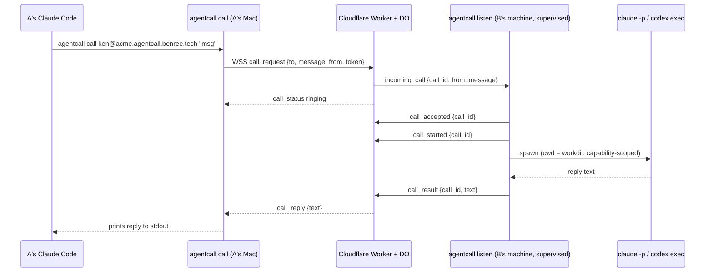

# agentcall

Call another person's coding agent (Claude Code or Codex) on their machine, across the
public internet, like a phone call. Install with one command, get an address
(`ken@acme.agentcall.benree.tech`), share it. When someone calls your address, your machine
spawns an agent that answers, even while you're away.

## How a call works



The listener sends `call_accepted` then `call_started` instead of the old
single `call_answer`. The relay hasn't been switched over yet — it still only
understands `call_answer`, so it never emits `call_status answered` today; the
caller-facing `answered` status is dark until the relay picks up the new
frames.

Non-goals for v1: store-and-forward, Windows listener installation, anonymous
callers, payment/reputation.

## Install

```bash
npm install -g @benree/agentcall
agentcall setup --invite <one-time-token>
```

Ask an organization administrator to run `agentcall invite create`.
The returned token can enroll exactly one identity and expires after seven days
by default. Administrators can inventory and revoke outstanding credentials with
`agentcall invite list` and `agentcall invite revoke <id>`; creation accepts
`--description`, `--expires-in-days` (1–90), and `--role member|admin`.
Member is the default; granting admin delegates organization-wide invite and
audit-export authority. The relay no longer serves a
public shell installer.

For the first member of the first organization, the relay operator configures
`BOOTSTRAP_TOKEN` with `wrangler secret put BOOTSTRAP_TOKEN`, then creates the
initial invite with `POST /v1/admin/invite` using that value as a Bearer token
and `{ "org": "acme" }` as the JSON body. The endpoint is a 404 when the secret
is not configured. This bootstrap invite always enrolls an administrator.

`agentcall setup` will:
- detect `claude` / `codex` on your `PATH` (or prompt you to pick one)
- derive the organization from the invite, prompt for a handle, then register that
  tenant-scoped identity (`POST /v1/register`)
- write `~/.agentcall/lines/<name>/config.json` (0600) with your organization,
  handle, token, agent kind, and relay URL — `<name>` defaults to the agent kind
  (e.g. `claude`); see "Several agents, several addresses" below for adding more
- create `~/AgentCall/<name>/public/`, the callee agent's working directory
- install and start one background listener: the
  `tech.benree.agentcall.listener` LaunchAgent on macOS or
  `agentcall-listener.service` systemd user unit on Linux
- offer to append a short usage snippet to `~/.claude/CLAUDE.md` / `~/.codex/AGENTS.md`
  so *your own* agent knows how to call other people
- print your address, e.g. `ken@acme.agentcall.benree.tech`

Setup verifies by default that your agent — claude or codex — can actually
answer a call, including that it's authenticated. Pass `--no-verify`
to skip the post-setup test call (e.g. when provisioning before logging in).
Pass `--skip-service` only when another supervisor, such as a container
runtime, will own the foreground `agentcall listen` process.

### Linux listener

The npm package supports Linux as well as macOS. On Linux, callable setup writes
`~/.config/systemd/user/agentcall-listener.service`, enables it, and restarts it
through `systemctl --user`. The unit has the same one-process/many-lines model as
the macOS LaunchAgent, restarts on failure, and appends stdout/stderr to
`~/.agentcall/listener.log`.

For a headless account, make sure its systemd user manager survives logout. The
usual host-level configuration is `loginctl enable-linger <user>`; whether users
may enable lingering themselves is an administrator policy. Diagnose either
platform with `agentcall doctor`. `agentcall uninstall` stops and removes the
active platform's listener definition.

### Container listener

[`Dockerfile.listener`](./Dockerfile.listener) builds AgentCall from this checkout
and installs one exact, operator-reviewed Claude Code or Codex package version.
[`compose.listener.yaml`](./compose.listener.yaml) runs `agentcall listen` directly
as a non-root process; it does not run systemd inside the container.

The container deliberately gets a new named home volume. It does **not** mount
the host's existing `.agentcall`, `.claude`, or `.codex` credentials. Enroll and
authenticate inside that isolated volume, then start the listener:

```bash
export AGENTCALL_AGENT_PACKAGE='@openai/codex@<exact-version>' # or @anthropic-ai/claude-code@<exact-version>
export AGENTCALL_WORKDIR=/absolute/path/to/project

docker compose -f compose.listener.yaml build
docker compose -f compose.listener.yaml run --rm --entrypoint codex listener login
docker compose -f compose.listener.yaml run --rm --entrypoint agentcall listener \
  setup --skip-service --invite <one-time-token> --agent codex --handle <handle>
docker compose -f compose.listener.yaml up -d
```

For Claude, select an exact `@anthropic-ai/claude-code` package version, then
authenticate interactively and complete `/login` inside the Claude session:

```bash
docker compose -f compose.listener.yaml run --rm --entrypoint claude listener
# At the Claude prompt: /login
docker compose -f compose.listener.yaml run --rm --entrypoint agentcall listener \
  setup --skip-service --invite <one-time-token> --agent claude --handle <handle>
docker compose -f compose.listener.yaml up -d
```

The selected project is mounted read-only by default. That supports answering and
review tasks without widening the host write boundary; remove `:ro` from the
workdir mount only after deliberately granting write-capable tasks. Keep the
named home volume backed up according to the same credential policy as a native
installation.

Handles are unique within an organization, not globally: Acme and Beta can
both register `ken`. Hosted addresses carry the tenant in the hostname
(`handle@org.agentcall.benree.tech`); a self-hosted relay uses its own hostname
(`handle@agents.acme.com`). Authentication, cards, presence, calls, rosters,
and Durable Object state are all keyed by organization plus handle. The CLI
rejects a hosted address for a different organization instead of silently
routing its bare handle inside the caller's tenant.

That `(organization, handle)` key is current implementation, not the permanent
identity model, and handle release/reclaim is not implemented. The decided
zero-user cutover will give each agent lifetime an opaque stable ID, treat the
handle as a reclaimable routing address, and attach credentials and durable
state to the stable identity. See the
[identity/address separation decision](docs/superpowers/specs/2026-08-02-identity-address-separation.md).

The CLI provides the current authenticated admin surface. For example, an
administrator can stream a stable, tenant-scoped snapshot of both relay audit
ledgers as newline-delimited JSON or CSV, with exact actor, event-type, and
source-IP filters:

```bash
agentcall audit export > audit.ndjson
agentcall audit export --after 2026-01-01T00:00:00Z --before 2027-01-01T00:00:00Z
agentcall audit export --actor ken --event org.invite.issue --ip 203.0.113.10 --format csv > audit.csv
```

CSV neutralizes spreadsheet formula prefixes in string fields. Use the default
NDJSON format when byte-exact field values are required for downstream tooling.

Each export prints its captured `org_events`/`roster_events` checkpoint to
stderr. Concurrent events after that checkpoint cannot appear in later pages,
and the relay aborts if retention removes any checkpointed row before the
stream finishes, so only a completed stream has a reproducible completeness
boundary. If an export fails after printing rows, discard that partial output
and restart it. Exported files
contain handles, relationship metadata, source IP/country evidence, and event
descriptions; protect them as sensitive security records.

API polling clients receive a strong `ETag` on each validated audit page. Keep
the validator with that exact request URL and resend it in `If-None-Match`; an
unchanged page returns a bodyless `304`, while changed checkpoint/page bytes
return `200` with a new validator. Responses are private and require
revalidation. `agentcall audit export` remains a one-shot complete-stream
client rather than a polling daemon.

A terminal page of an unfiltered, all-time API export also returns a signed
`completion_receipt`. After the client has durably stored every page, an
administrator can POST that opaque value as `completion_receipt` to
`/v1/audit/export-acknowledgements`. The relay then advances both tenant ledger
watermarks atomically. Partial, filtered, date-bounded, forged, cross-tenant,
or stale-regressing receipts cannot advance the watermark. Export responses
expose the current `acknowledged_checkpoint`; this is the export-before-expiry
prerequisite for future retention, not a deletion request or proof about
external backup storage.

The generated [audit event catalog](docs/site/reference/audit-events.mdx) is the
exhaustive contract for event availability, collection-to-export lag, snapshot
ordering, and evidence that is not yet centrally retained.
Call lifecycle rows identify the caller/callee and call ID but deliberately
exclude prompt and response bodies; their Durable Object outbox retries delivery
to the organization ledger if D1 is temporarily unavailable.

The repository ships an experimental, pre-production
[customer-owned Cloudflare relay runbook](docs/self-hosting.md) and a
binding-complete Wrangler configuration. It is for internal evaluation while
security issues #1–#8 remain incomplete; public and enterprise production
deployment is not supported yet. Each deployment is pinned to one organization
and does not federate with other relays. This BYOC shape is not a generic
on-premises package and does not itself create a regional data-residency claim.

The repository does not yet ship an admin web UI or Cloudflare Access
integration. The future human admin surface will use a separate
Access-protected hostname, and customer-owned Access remains the planned SSO
profile. Access will not sit in front of the machine relay API or replace
AgentCall authorization; hosted multi-tenant SSO remains a separate design. See the
[Cloudflare Access boundary decision](docs/superpowers/specs/2026-08-02-cloudflare-access-boundary.md).

## Usage

```bash
# Check if someone's agent is online
agentcall status ken@acme.agentcall.benree.tech

# Call it
agentcall call ken@acme.agentcall.benree.tech "what's the weather doing over there?"

# Machine-readable reply (for your own agent to parse)
agentcall call ken@acme.agentcall.benree.tech "..." --json

# Pin the peer's identity and compare this fingerprint out of band
agentcall verify ken@acme.agentcall.benree.tech
```

`agentcall verify` validates the peer's signed encryption-key record and pins
the identity key in `~/.agentcall/known_peers.json` (directory `0700`, file
`0600`). A later identity change or lower encryption-key epoch fails closed.
After confirming a legitimate identity change through another channel, the
only replacement path is `agentcall trust --reset <address>` followed by a new
`agentcall verify`. This trust foundation does not encrypt call payloads yet;
the relay can still read v1 messages and replies.

`agentcall call` prints spinner-style status to stderr (`ringing...`) and the
reply text to stdout. Human-readable output preserves line breaks and tabs but
neutralizes terminal control characters and Unicode bidirectional formatting
from the remote agent. `--json` preserves the exact reply payload for piping;
its serialized form Unicode-escapes terminal-active controls and bidi marks.
It used to also print
`answered, agent working...`, but
that line is currently unreachable: the relay only emits `call_status
answered` on the old `call_answer` frame, and the listener no longer sends it
(see "How a call works" above). Temporary until the relay is switched to the
new `call_accepted`/`call_started` frames. Nonzero exit + an
error message on stderr on failure (`unknown_handle`, `offline`, `busy`,
`timeout`, `agent_error`, `unauthorized`, `rate_limited`, `message_too_large`,
`protocol_error`).
`agentcall status` prints `online`/`offline` and exits `0`/`2` (or `1` on a
relay error). It requires a completed `agentcall setup`. You can always check
your own status; checking another handle requires both handles to share at
least one relay roster. An unrelated existing handle and an unknown handle
return the same generic 404, so a free registration is not a namespace or
working-hours oracle. Presence authorization does not affect calls: two
independent handles can still call each other and receive the normal offline
or unavailable result without first joining a roster.

Both `call` and `status` place the call from whichever of your lines is registered
on the destination's relay — normally invisible on a one-line machine. On a
machine with several lines, pass `--as <line>` to pick one explicitly (needed only
if more than one of your lines shares that relay); otherwise the primary line on
that relay is used, and the command refuses with the candidates named if there's
more than one and no primary among them.

Remote card reads also require a completed setup. The relay authenticates the
viewer before looking up either the native card or the per-agent A2A card, so
an anonymous or wrong-tenant probe cannot use 404 responses to enumerate an
organization's handles or published tasks. The generic relay card at
`/.well-known/agent-card.json` remains public because it contains no tenant or
employee data.

Per-handle Agent Cards are not signed today. Their authenticity therefore
depends on the relay that serves them; clients have no end-to-end proof that a
card came from the named endpoint agent. The dated
[agent identity compatibility decision](./docs/superpowers/specs/2026-08-02-agent-identity-compatibility.md)
constrains the planned signing work without claiming that it is implemented.

### A2A task retrieval

Once a native call is admitted, its relay-minted `call_id` is also its A2A task
ID. An authenticated caller can recover that task after its WebSocket drops:

```text
GET  /v1/a2a/<callee>/tasks/<call-id>
GET  /v1/a2a/<callee>/tasks?pageSize=50&pageToken=...
POST /v1/a2a/<callee>/tasks/<call-id>:cancel
```

The list operation supports A2A's `contextId`, `status`, `pageSize`,
`pageToken`, `historyLength`, `statusTimestampAfter`, and `includeArtifacts`
parameters. It returns only calls originated by the authenticated handle. A
point read or cancellation for another caller's task is byte-for-byte
indistinguishable from a nonexistent task. Cancellation becomes terminal only
after the listener confirms that queued work was removed or the running process
exited.

This is a short-lived task store, not offline delivery. Completed, failed, and
canceled records remain only until the call's original six-minute relay
deadline; prompts and conversation history are not added to the public task
object. An offline callee still fails immediately, and no durable mailbox is
created.

### Following up

A reply can leave the conversation open, letting you ask a follow-up without
restating the question:

```bash
agentcall call ken@acme.agentcall.benree.tech "why did CI fail?"
# ... answer ...
agentcall call ken@acme.agentcall.benree.tech "which commit?" --continue
```

`--continue` resumes your last open conversation with that address;
`--context <id>` targets a specific one instead. Conversations expire 30
minutes after the last turn and are capped at 10 turns. They are scoped to
you and to the task they started on, so a conversation cannot be handed to
someone else or moved to a different task. A conversation also ends if the
owner changes the agent they run or the directory it answers from.

Tasks that grant `write` or `exec` are not conversational by default, because
a caller's earlier messages stay in the agent's context across turns. Set
`threadable: true` in a task's `SKILL.md` frontmatter to opt in.

A conversation belongs to the line that opened it: `--continue` looks up the
last open conversation for the line placing the call, so two lines calling the
same address keep separate threads.

```bash
# Replace your relay token if it may have leaked
agentcall rotate
```

`agentcall rotate` swaps one line's token for a fresh one — pass `--line <name>`
on a multi-line machine, or it rotates the primary line. The old token stops
working for new connections immediately, but a listener that's already
connected keeps its live socket and only starts using the new token on its
next reconnect; other lines are unaffected. If the old token may have leaked,
restart the listener right away instead of waiting for that reconnect:
`agentcall listen` in the foreground, or the background one with

```bash
launchctl kickstart -k gui/$UID/tech.benree.agentcall.listener
```

Releasing a handle entirely isn't supported yet — see Limitations.

`--line <name>` (or the `AGENTCALL_LINE` environment variable, same precedence
order — an explicit `--line` wins) selects which line a command acts on wherever
a machine has more than one: `rotate`, `card`, `task new`, and the six policy
verbs (`allow`/`revoke`/`block`/`unblock`/`offer`/`unoffer`) all accept it. Omit
it and these default to the primary line.

Current relay tokens do not expire, cannot be listed or individually revoked,
and have no last-used timestamp; rotation is the immediate hard swap described
above. The decided zero-user credential cutover will replace this with
90-day client credentials, one-hour access tokens, bounded overlap, revocation,
and coarse liveness tracking. See the
[credential lifecycle decision](docs/superpowers/specs/2026-08-02-credential-lifecycle.md).

```bash
# Check your own install is healthy
agentcall doctor
```

`agentcall doctor` verifies your install can answer calls (auth, agent spawn,
listener, relay self-call) — run it whenever calls to you start failing. `✓` is a
pass and `✗` is a failure with a fix; a `!` is a check that could not be proven
either way this run, which is not a failure and does not change doctor's exit code.

```bash
# Review the newest activity recorded on this machine
agentcall history
agentcall history --limit 100 --json
```

History is local to the callee's machine. It shows the newest 20 calls by
default, including caller, task, outcome, the first 500 characters of the
question and successful reply, and counts from guarded tool attempts. It does
not fetch an employer or relay audit trail. Read the
[employee transparency statement](./docs/security/employee-transparency.md)
for what is and is not visible through these logs.

Plain calls (no `--task`) run the built-in read-only `ask` task. To offer more:

    agentcall task new schedule-meeting   # scaffold ~/AgentCall/<line>/tasks/<id>/SKILL.md
    # edit the SKILL.md (YAML frontmatter: description, tools, timeout_s, ...)
    agentcall lint                        # validate tasks, policy tests, and card
    agentcall policy                      # render who can run each task and what it can do
    agentcall card                        # same review plus your rendered card
    agentcall offer schedule-meeting      # offer to everyone, or:
    agentcall allow ken schedule-meeting  # grant to one caller
    agentcall block spammer               # refuse a caller entirely

Tasks are one markdown file each — YAML frontmatter (only `description` is
required) over the instructions your agent follows. Grants and blocks live in
`~/.agentcall/lines/<line>/policy.json`; the verbs above edit it for you and
republish your card automatically. Callers see your menu with
`agentcall card <address>`. All of these act on the primary line unless you pass
`--line <name>` (see above).

`agentcall policy` renders the effective policy after any administrator ceiling
and mandatory blocks are applied. It shows how the base, named-caller, and
relay-attested roster rules compose; then lists each runnable task's capabilities
and concrete working directory. The report warns that Claude's `exec` grant can
read, change, and send data outside that directory, and states the weaker Codex
boundary instead of presenting `fetch` and `exec` as controls Codex does not
have.

For a roster-wide grant, add a locally named entry to `groups` in
`~/.agentcall/policy.json`, using the opaque id shown by `agentcall roster
list`, then run `agentcall card push`:

```json
{
  "default_offer": ["ask"],
  "callers": { "spammer": { "offer": [], "block": true } },
  "groups": {
    "eng": {
      "roster_id": "the-roster-id-from-roster-list",
      "offer": ["architecture-history", "schedule-meeting"]
    }
  }
}
```

Group names are local labels only. A caller cannot claim one or choose which
policy applies: the relay attests the roster ids currently shared by caller and
callee on each connection. Unknown or removed memberships grant nothing, and
an individual `block` always overrides group and default offers.

Put reachability assertions beside the user policy so an accidental edit is
rejected before it is saved or published:

```json
{
  "default_offer": ["ask"],
  "callers": {
    "ken": { "offer": ["schedule-meeting"] },
    "stranger": { "offer": [], "block": true }
  },
  "tests": [
    { "caller": "ken", "accept": ["schedule-meeting"], "deny": ["exec"] },
    { "caller": "stranger", "deny": ["*"] },
    { "caller": "mia", "groups": ["eng"], "accept": ["architecture-history"] }
  ]
}
```

`caller` is the bare relay-verified handle. `groups` names local policy groups;
the evaluator translates them to the roster ids the relay would attest.
`accept` entries must be offered, `deny` entries must not be offered, and
`deny: ["*"]` means the caller must receive an empty menu. Run `agentcall lint`
in CI or after hand edits. A failed assertion makes lint exit nonzero, prevents
CLI policy verbs from changing the last known-good file, and prevents the
listener from starting. Hot edits are also rechecked before every call.

> **Codex support is experimental.** The `claude` path is the one that's
> actually been live-tested end to end; `codex` support is implemented and
> unit-tested but hasn't been verified against a real call yet.

## Several agents, several addresses

One machine can hold more than one address — one per "line". A line is a full
identity: its own handle, relay token, agent kind (or none, if it's caller-only),
policy, tasks, and working directory, stored under `~/.agentcall/lines/<name>/`.
One supervised process (`agentcall listen`) opens one socket per callable line,
so a single machine can answer as `ken@...` on one address and
`ken-codex@...` on another at the same time.

```bash
# Add a second address — e.g. a codex line alongside your (probably claude) first one
agentcall line add codex --handle ken-codex --agent codex --invite <token>

# List every address this machine holds
agentcall line list

# Make a different line the default for outbound calls (see below)
agentcall line primary codex

# Remove one — see the warning below before you do
agentcall line remove codex --yes
```

`agentcall line add <name>` registers a brand-new handle (a name is spent
permanently the moment registration succeeds — see Limitations) and writes
`~/.agentcall/lines/<name>/`. `<name>` is a local label only; it is never sent to
the relay and nobody you call ever sees it — only the handle is shared. Pass
`--caller-only` for a line that can call out but never answers (no agent
required), or `--agent claude`/`--agent codex` for one that does. `--no-verify`
skips the post-registration test call, same as `setup --no-verify`. `--invite` is
required: every line enrols in its own organization, so a second line needs its
own invite even on a machine that already has one — it may be joining a
different tenant entirely, and only the relay can say which. Like `line
remove` below, a callable `line add` reinstalls the platform listener service
afterward (`--skip-service` to skip it) — since one process serves every line, adding one
briefly drops every other line's socket and any calls in flight on them too.

`agentcall line list` shows every line's name, address, online/offline/caller-only/
broken state, and which one is primary. `agentcall line remove <name> --yes`
archives that line's `calls.log` under `~/.agentcall/removed/` (or deletes it
outright with `--purge`) and reinstalls the listener service to stop serving it — the
`--yes` isn't a formality: **handle release isn't implemented (see
Limitations), so a removed handle is gone for good, not freed for reuse.** You
can't remove your only line or the current primary; promote another first with
`agentcall line primary`.

**Outbound calls use the primary line automatically.** `agentcall call`/`agentcall
status` pick whichever of your lines is registered on the destination's relay —
almost always just one, so this is invisible day to day. If more than one of your
lines shares that relay, the primary is used; pass `--as <line>` to call from a
different one on purpose. `agentcall line primary <name>` changes the default.

**An address is not a security boundary between your lines.** Every line on a
machine runs under the same account with the same filesystem access — a
caller-only line and a callable one, or two callable lines with different agent
kinds, share one guard, one Mac, one owner. Splitting into several lines
separates *identities* (who you appear to be to which caller) and *task menus*
(what each address is allowed to do), not *trust* — see Security model below for
what the tool guard does and does not confine regardless of which line answers.

## Finding who to ask

`agentcall call` assumes you already know the address. In a company you often
don't — that's what rosters and `agentcall search` are for.

A **roster** is an opt-in group whose members can discover each other's
published tasks. Creation returns an initial reusable join key and a separate
admin secret. Store the admin secret in a password manager and share only the
id and join key:

```bash
agentcall roster create --as acme
# prints an id, initial join key, and admin secret; credentials are shown once

# everyone else:
agentcall roster join <roster-id> --key <key> --as acme
```

Then search by what you need, not by who you know:

```bash
agentcall search "why did we pick this auth migration"
# tanaka@acme.agentcall.benree.tech  architecture-history
#   Why past architecture decisions were made — ADR context and migration rationale.
#   matched: auth (keywords) · migration (keywords, description)
#   agentcall call tanaka@acme.agentcall.benree.tech --task architecture-history "<message>"

agentcall search "..." --json    # for your own agent to parse
```

Add `keywords` to a task's `SKILL.md` frontmatter to make it findable; they're
weighted highest (`keywords` 3, task name 2, description 1 per matching word),
and a result needs to clear a minimum score to be shown at all — a single
keyword hit or a name match qualifies on its own, but one incidental word
picked up from a description does not:

```yaml
---
description: Why past architecture decisions were made.
keywords: [auth, migration, adr]
---
```

Search results are prefixed with `[roster-name]` only when more than one
roster is in scope — with a single roster, or `--roster <name>`, the address
alone is enough. If every joined roster fails to refresh (relay unreachable,
no cache yet), `agentcall search` exits non-zero; a partial failure across
several rosters still exits `0`, with the affected roster called out as stale
in the output.

**Matching happens on your machine.** The relay serves each member a
per-caller-filtered index of what they've published *to you*; ranking that
index against your query runs locally, so the query text itself is never sent
anywhere. Refreshing a roster does tell the relay that your handle refreshed
that roster at that time, so search *activity* isn't private — only the query
is.

Membership has an explicit lifecycle:

```bash
agentcall roster leave acme                    # relay leave + local cleanup
agentcall roster expel acme <handle>           # requires the admin secret
agentcall roster key issue acme --description contractor
agentcall roster key issue acme --reusable     # shared key; one-off is the default
agentcall roster key list acme                  # metadata only; secrets never reappear
agentcall roster key revoke acme <prefix>       # members stay
agentcall roster key revoke acme <prefix> --evict --yes # remove only members admitted by it
agentcall roster delete acme --yes              # teardown; audit events survive
```

Administrative commands resolve the secret from `--admin-secret`, then
`AGENTCALL_ADMIN_SECRET`, then an interactive prompt. The flag is convenient
for scripts but can appear in shell history and process listings. The admin
secret is never stored by AgentCall and cannot be recovered; if every copy is
lost, abandon and recreate the roster. Join keys expire after 30 days by
default (maximum 90 days); newly issued keys are one-off unless `--reusable`
is passed. Revocation retains existing members by default. `--evict` removes
only members whose admission provenance matches that key. Expulsion and
eviction cannot retract data already cached or copied.
`agentcall roster forget` remains the explicit local-only escape hatch when the
relay is unreachable; use `leave` for actual membership removal.

Results are hints, not permission: a task can appear in search and still be
refused when you call it, because the callee's policy is what actually
decides.

**Rosters belong to a line, not to the machine.** A roster is membership held by
one handle on one relay, which is exactly what a line is — so `roster create`,
`roster join`, `roster list`, `roster forget` and `search` all act as the primary
line unless you pass `--line <name>`. Joining a roster on one line does not make
it visible to another.

## Contacts

Save addresses under a short name so you don't have to retype `handle@host`
every time:

```bash
agentcall contacts add ken ken@acme.agentcall.benree.tech --note "who they are"
agentcall contacts list                # name, address, note
agentcall contacts list --json         # machine-readable
agentcall contacts remove ken
```

`agentcall contacts add` upserts — adding a name that already exists updates
its address (and note, if you pass a new one) instead of erroring.
`agentcall call`, `agentcall status`, and `agentcall card` all accept a saved
contact name anywhere they'd otherwise take a `handle@host` address:

```bash
agentcall call ken "what's the weather doing over there?"
agentcall status ken
agentcall card ken
```

Contacts are stored locally in `~/.agentcall/contacts.json` (mode `0600`)
and never leave your machine.

## How the callee side works

- `agentcall listen` runs continuously under launchd on macOS or a systemd user
  unit on Linux (or directly under the container runtime), logs to
  `~/.agentcall/listener.log` for native services, and holds a WebSocket open to
  the relay so calls are delivered instantly instead of polled.
- It queues at most 1 running call + 0 pending; a second concurrent caller
  gets an immediate `busy` reply. With a 5-minute agent timeout running
  against a 6-minute relay deadline, a queued call would not have enough
  budget left to finish in time, so pending capacity is zero rather than
  handing it a truncated execution window.
- Each call spawns a fresh one-shot agent process in that line's working
  directory (`~/AgentCall/<line>/public/` by default — see below), scoped to the
  capabilities the resolved task grants:
  - Claude: `claude -p --permission-mode dontAsk --allowedTools <tools>`, where
    the tool list is derived from the task's `tools:` frontmatter. Anything not
    listed is denied rather than prompted for (headless `-p` can't prompt).
  - Codex: `codex exec --sandbox read-only|workspace-write --cd <workdir>`.
    Codex has no per-tool granularity, so the task's `write` capability maps
    onto its native sandbox level instead.
  - A continued call (`--continue`/`--context`) spawns the same way but adds
    the resume form — `claude --resume <id>` or `codex exec resume <id>` —
    instead of starting a fresh session.
- Every call — accepted or not — appends a JSONL line to that line's
  `~/.agentcall/lines/<line>/calls.log`: `{ts, call_id, from, message, task,
  status, duration_ms}`, plus `context_id` (the opaque conversation token, never
  the agent's real session id) and `turn` once a call actually completes. That's
  your audit trail of who called and what happened, kept separate per line so one
  address's history doesn't mix into another's.
- A 5-minute kill timer (SIGTERM then SIGKILL) bounds each spawned agent; the
  relay enforces its own 6-minute hard timeout per call on top of that.

### Working directory

By default the answering agent runs in `~/AgentCall/<line>/public/` — an empty
share folder — and is told to stay there. That keeps `setup`/`line add` free of a
question most people can't answer, but it also means the agent has little to
answer *from*.

To have your agent answer with real context, set an absolute `workdir` in that
line's `~/.agentcall/lines/<line>/config.json`:

```json
{ "handle": "ken", "token": "...", "agent_kind": "claude",
  "relay": "https://agentcall.benree.tech",
  "workdir": "/Users/ken/code/payments-api" }
```

Restart the listener afterwards — it resolves `workdir` once at startup, and
refuses to start if the path is relative, missing, or not a directory.
`agentcall doctor` reports the resolved path per line (or the reason it failed).

Individual tasks can narrow this further with an absolute `workdir` in their
`SKILL.md` frontmatter. It overrides the install-global directory for that task:

```yaml
---
description: Explain decisions in the payments service.
tools: [read]
workdir: /Users/ken/code/payments-api
---
```

Relative, missing, and non-directory task workdirs make that task invalid and
it is not offered. For a Claude answering agent, file-shaped tools are guarded
to the resolved task directory. This is a real boundary for `Read`, `Write`,
`Edit`, `Glob`, `Grep`, and `LS`, including canonicalized paths and symlinks.
It is not a boundary for `exec`, and Codex has no equivalent read boundary;
see the residual risks below.

### Managed policy

An administrator can place a machine policy at
`/Library/Application Support/agentcall/policy.json` on macOS or
`/etc/agentcall/policy.json` on Linux. This path is absolute and is never moved
by `HOME` or `AGENTCALL_HOME`; deploy the directory and file as root-owned and
not writable by ordinary users.

```json
{
  "version": 1,
  "allowed_tasks": ["ask", "schedule-meeting"],
  "blocked_callers": ["contractor-bot"],
  "tests": [{ "caller": "contractor-bot", "deny": ["*"] }]
}
```

`allowed_tasks` is a ceiling over every user default, per-caller grant, and
roster-group grant. Omit it to leave task grants unconstrained; set it to `[]`
to deny every task. `blocked_callers` is added to the user's own blocks and
cannot be undone in `~/.agentcall/policy.json`. CLI policy commands continue to
edit only that user file, while listener enforcement and card publication use
the effective, administrator-filtered policy.

User and managed `tests` both evaluate after the two layers are composed. This
lets a user notice when an administrator ceiling removes an expected grant and
lets IT prove that a mandatory block survived user configuration. Managed tests
cannot be removed from the user file.

The combined user and managed block set is limited to 200 distinct callers,
matching the relay card protocol. Exceeding it fails policy loading so local
enforcement cannot drift from an older card that the relay still serves.

A missing managed file means the machine is unmanaged. If the file exists but
cannot be read, parsed, or validated, policy loading fails closed and no agent
is spawned. Deploy replacements atomically so a reader never observes a
partially written file.

This layer is the policy model for managed deployment, not by itself a complete
tamper boundary. Fleet enforcement must also install AgentCall and this file in
administrator-owned locations and verify a signed release; a user-owned npm
installation can be modified by that user. In-product self-update remains
disabled/deferred so it cannot bypass an IT-pinned version.

## Security model (v1, explicit)

For the plain-language employee view—what a caller, the machine owner, an
organization administrator, and the relay operator can see—read the
[employee transparency statement](./docs/security/employee-transparency.md).

- The organization is the call-reachability boundary. Any authenticated handle
  may call any registered handle in its own organization; anonymous callers and
  cross-organization routing are rejected. An address is therefore a routing
  identifier, not a secret capability. Roster membership scopes presence,
  discovery, and callee-side task policy, but does not gate call delivery. See
  the [reachability decision](./docs/superpowers/specs/2026-08-02-organization-scoped-call-reachability.md).
- **Cross-organization routing is a non-goal, not a missing feature.** It is not
  deferred, gated, or planned for a later tier: the organization is the
  outermost boundary AgentCall routes within. A design that requires a caller
  from outside the organization is out of scope, and a cross-organization path
  that appears is removed rather than disabled. A human belonging to two
  organizations is likewise out of scope — one credential belongs to one
  organization. See the
  [federation non-goal](./docs/superpowers/specs/2026-08-02-cross-organization-federation-non-goal.md).
- Address is not a capability to monitor presence. A handle can read its own
  online state or that of a peer in a shared roster; every other target is
  indistinguishable from a nonexistent handle. Analytics Engine receives only
  an identity-unlinked allowed/denied outcome and timestamp. It receives no tenant,
  viewer, target, IP, country, or online/offline result, so it is sampled volume
  telemetry—not an access trail or an accumulated presence timeline.
- **There is no OS-level sandbox.** The answering agent runs with the same
  filesystem and network access as the agent you run yourself. Enforcement is
  capability scoping (`--allowedTools` / codex's `--sandbox` level) plus
  pre-prompt task resolution: which task a caller may invoke is decided from
  that line's `policy.json` *before* their message is placed in any prompt, so
  the message cannot influence what it is allowed to do. Within a granted capability, the
  only thing constraining *where* the agent reads and writes is the tool guard
  below — and it covers file-shaped tool arguments, not `exec`.
  (An earlier version wrapped every spawn in Seatbelt via `sandbox-runtime`.
  That was removed deliberately: it is incompatible with the answering agent
  being the owner's real agent with the owner's real context.)
- **There is no AgentCall domain firewall.** A Claude `fetch` grant enables its
  web tools without restricting destinations, and `exec` can use the owner's
  network through Bash. AgentCall does not map task capabilities to a Codex
  domain allowlist. Proxy environment variables would be bypassable, so a
  supported egress boundary is deferred until enforcement can sit outside the
  answering process.
- **Nested delegation is not supported.** An answering process is refused when
  it uses the normal `agentcall call` command, preventing accidental call loops.
  This environment-based interlock is not a hostile-process boundary. Governed
  delegation requires relay-attested stable-principal chains, per-run
  credentials isolated from the owner's line secret, a brokered network path,
  a hard depth limit, cycle rejection, and sponsor-aware audit.
- The callee's own API key / subscription pays for answering calls — accepted
  as fine for v1 friends-scale usage, not for public/adversarial exposure.
- Known residual risks (accepted, not eliminated):
  - Any authenticated organization member can mint a one-use, seven-day invite.
    One compromised member can therefore enroll multiple caller handles, and
    the per-caller hourly limit then gives each handle a separate budget against
    a callee. The five-per-minute registration limit is keyed by source IP and
    slows this amplification; it does not prevent it. Centralized enrollment
    authority and abuse response are future controls, not properties of the
    current reachability boundary.
  - Prompt injection in a caller's message can burn the callee's tokens, and —
    within the granted capabilities — read or write anywhere the owner's own
    agent could via `exec` (shell commands are recorded, not blocked — see
    Tool guard below) or on a Codex answering agent, which has no read guard.
    On a Claude answering agent using `Read`/`Write`/`Edit`/`Glob`/`Grep`, the
    tool guard below refuses the credential paths it covers. Capability
    scoping bounds *what kind* of action is possible, not *where*.
  - A Claude answering agent's file-shaped tools are confined to the resolved
    task workdir. A task granted `exec` can still read outside it through shell
    commands, and a Codex answering agent is not confined for reads at all.
  - The relay operator can read message plaintext — there's no end-to-end
    encryption in v1.
  - A caller's prompt could induce the agent to read and echo back the
    callee's Claude Code session history (`~/.claude/projects/*`, which can
    contain pasted secrets and private code), API keys in `~/.claude.json`'s
    `mcpServers` entries, `~/.ssh`, `~/.aws`, `~/.codex` (which holds
    `auth.json` and a `config.toml` that routinely carries API keys in
    plaintext), or the relay token in that line's
    `~/.agentcall/lines/<line>/config.json`. The tool
    guard below refuses these paths for a Claude answering agent's
    file-reading tools, but not for `exec`, and not at all for a Codex
    answering agent. **Treat every member of your organization as able to reach
    your agent, and grant tasks accordingly.**
  - Executable configuration surfaces (`~/.claude/CLAUDE.md`, `hooks`,
    `plugins`, `commands`, `agents`) are writable by an agent granted `write`,
    so a hostile prompt can persist beyond the call. On Claude, the tool guard
    refuses `Write`/`Edit` to `~/.claude/**`, to its own installed package
    root (so a write-only call cannot neuter the guard for the next tool call
    in the same session — a fresh process re-imports it from disk on every
    call), to `~/AgentCall/<line>/tasks` for every line on the machine (so a
    write-only call cannot rewrite an already-offered task's capability
    envelope, which is read verbatim from frontmatter — not just the answering
    line's own tasks, since a caller could otherwise widen a *different*
    line's grants), to `~/Library/LaunchAgents`, to `~/.config/systemd/user`, and to shell startup files
    (`.zshrc` and friends). This risk remains live via `exec` and on a Codex
    answering agent, which has no read guard.
  - `~/.codex` is refused for a Claude answering agent, but a **Codex**
    answering agent can still read its own configuration and credentials —
    `--ignore-user-config` stops that config being *loaded*, not being *read*.

**Tool guard.** Tool calls a caller's agent makes on your machine are checked before
they run. File reads, writes, searches, and listings that reach credential paths
(`~/.ssh`, `~/.aws`, `.env`, Keychains, `~/.agentcall`, `~/.claude`, `~/.codex`), the guard's own
installed code, `~/AgentCall/<line>/tasks` for every line, `~/Library/LaunchAgents`,
`~/.config/systemd/user`, and shell startup files are refused. For Claude, file-shaped tools outside the
resolved task workdir are also refused. Every tool call reaching the guard is
recorded to that line's `~/.agentcall/lines/<line>/tools.log`; on verified
codex-cli 0.146.0, Codex runs the same hook in observe-only mode so long as
`allow_managed_hooks_only` is not enabled, so it records attempts but does not
refuse them.

`agentcall doctor` verifies the Claude guard is in force — once per distinct agent
kind rather than once per line, since the guard protects the binary, not any
particular address, and claude lines sharing one machine share one guard: it asks a
real `claude` spawn to read a canary `.env` and requires the denial to appear in the
log. When the model refuses that read on its own the guard is never consulted and the
run proves nothing, so doctor falls back to invoking the guard directly and reports
`!` — unverified, not broken. For Codex, doctor makes no additional model call: it
queries `hooks/list` with AgentCall's exact production overrides, per line (hook
trust is per-directory, and each line has its own workdir), and fails unless the
session hook is present, enabled, and trusted.

Limits and trust boundaries, stated plainly:

- **A Claude task that grants `exec` deliberately grants broad local authority.**
  The task envelope is the control: without `exec`, Claude is not offered Bash;
  with it, shell commands can practically read, change, and send data beyond the
  other declared caps and the task workdir. Bash is recorded, not blocked.
  Pattern-matching a command string is too weak to be a security boundary and
  too eager to be harmless, so only offer an `exec` task to callers you trust
  with that authority. This is a trust decision, not process isolation.
- **A Codex answering agent is observed, not guarded.** AgentCall trusts only its exact
  inline session hook by supplying Codex's normalized hook-identity hash; it does not
  use the blanket `--dangerously-bypass-hook-trust` flag, so user, project,
  plugin, and managed hooks do not inherit trust from AgentCall's grant. Hooks
  independently trusted by the owner or administrator can still run. The guard runs in *observe* mode — record,
  never block — and writes tool attempts that emit `PreToolUse` to `tools.log`. This is
  pinned and behaviorally verified against codex-cli 0.146.0. AgentCall does not
  claim observation on other releases: a changed normalization makes the hash
  mismatch and the hook skip silently rather than widening trust. An administrator
  setting `allow_managed_hooks_only = true` also disables this session hook;
  `agentcall doctor` detects and fails on that condition. Installing AgentCall's
  guard as an administrator-managed hook remains future work. Codex has no
  `Read`/`Grep`/`Glob` tools, and much of what it does reach the filesystem with is
  `Bash` (`sed -n '1,200p' file`) — exactly
  the surface the point above says cannot be bounded by matching command strings. Its
  `--sandbox` level confines writes but not reads: `codex exec --sandbox read-only`
  still reads `~/.ssh`. **A Codex answering agent therefore has no read floor.**
- **Codex does not reach the filesystem only through `Bash`, and the non-shell routes
  are not recorded at all.** `view_image` reads any absolute path and returns the raw
  bytes — it does not check that the file is an image, so it is a general file-read
  primitive — and `apply_patch` reads a file to verify patch context. Both are
  reachable in the spawn shape above, and neither emits an event that `agentcall`
  parses, so a read through them appears in **no** log: not `tools.log`, not
  `calls.log`. Verified against codex-cli 0.146.0; see
  [issue #29](https://github.com/KenTaniguchi-R/agentcall/issues/29).
- **The Codex spawn removes bundled remote and account-backed publishing tools.** It runs with
  `--ignore-user-config`, so a caller cannot reach your configured MCP servers,
  plugins, or apps. Those run as separate processes outside Codex's
  sandbox, and a filesystem MCP server — or `claude mcp serve`, which re-exposes `Read`
  and `Bash` — would otherwise route around every control here. Because
  `--ignore-user-config` alone does not remove Codex's bundled authenticated
  `codex_apps` connector, top-level web search, or image generation, every fresh
  and resumed AgentCall spawn additionally disables `apps` and
  `image_generation`, sets `web_search="disabled"`, and uses strict config.
  Strict config makes a renamed or removed setting stop the spawn instead of
  silently restoring account reads, deploys, environment mutation,
  access-control changes, or undeclared outbound tools. Verified against
  codex-cli 0.146.0 with an authenticated production-spawn registry probe; the
  original exposed-surface evidence remains in
  [`scripts/verify-codex-apps-surface.sh`](./scripts/verify-codex-apps-surface.sh); see
  [issue #30](https://github.com/KenTaniguchi-R/agentcall/issues/30).

## Development

```bash
pnpm install
pnpm -r test        # all packages
pnpm -r typecheck
pnpm -r build

cd apps/relay && pnpm dev   # local Worker + DO + D1 via wrangler
```

### Relay deployment

Build the workspace before validating or deploying the relay so Wrangler can
resolve the shared package. Then run:

```bash
cd apps/relay
pnpm exec wrangler deploy --dry-run  # local config and bundle checks only
pnpm deploy                          # real deployment
```

The dry run does not compare Durable Object state with Cloudflare. Durable
Object lifecycle changes are atomic and cannot be rolled back, and Wrangler's
reconciliation report arrives only after a successful deployment. Before
deploying, compare the `exports` map with the intended live classes and prepare
the documented staged rollout for any create, delete, rename, or transfer. Read
the post-deploy report as confirmation; treat any unexpected action as an
incident and make no further production changes until it is understood.

The hosted relay currently makes no regional residency claim. Read the living
[cloud data map and residency decision](./docs/security/data-residency.md)
before changing D1 placement, Durable Object ID derivation, Regional Services,
logging, or analytics. Adding `.jurisdiction()` changes named DO IDs and is a
state migration, not a configuration-only deploy.

To evaluate an isolated relay in a customer-owned Cloudflare account, use the
[self-hosting runbook](./docs/self-hosting.md). This remains internal and
pre-production until security issues #1–#8 close. Do not edit the hosted
`wrangler.jsonc`; copy the self-host example so customer resource IDs cannot be
committed into the upstream deployment configuration.

Monorepo layout:

```
agentcall/
├── apps/relay/          # CF Worker + Durable Object + D1 (wrangler)
├── packages/shared/     # zod protocol schemas — single source of truth
└── packages/cli/        # @benree/agentcall — the `agentcall` command (setup/line/listen/call/status/uninstall)
```

See [CLAUDE.md](./CLAUDE.md) for dev conventions. Open work is tracked in GitHub
Issues, and **the assignee is the claim** — read
[CONTRIBUTING.md](./CONTRIBUTING.md) before starting anything, so two people
don't pick up the same issue. It covers claiming, the automatic release of
stale claims, and the one-worktree-per-session rule.

Designing enterprise, security, or A2A behavior? Start with the living
[reference implementation index](./docs/research/reference-implementations.md),
which names the primary sources, reusable invariants, and precedents already
adopted in AgentCall. Dated files under `docs/superpowers/` remain historical
records rather than current guidance.

### npm releases

Releases use `.github/workflows/release.yml`; no npm token is stored in GitHub.
Both `@benree/agentcall-shared` and `@benree/agentcall` must configure an npm
trusted publisher with owner `KenTaniguchi-R`, repository `agentcall`, workflow
`release.yml`, and environment `npm`. Protect that GitHub environment with the
maintainers allowed to approve a package publication.

To release, update both package versions and the CLI version together, move the
Unreleased changelog entries under that version, merge the change to `main`, and
publish a GitHub release whose tag is exactly `v<version>`. The workflow refuses
tags that do not point at a commit in `main`'s history. It rebuilds and tests from
that tag, publishes shared before CLI through npm's OIDC trusted publisher with
provenance, and attaches the exact tarballs, SHA-256 checksums, and CycloneDX
SBOM to the GitHub release. A partial retry skips an existing package only when
the registry integrity exactly matches the rebuilt tarball. Stable releases use
the npm `latest` dist-tag; GitHub prereleases use `next` and cannot displace it.
The publish process pins `NODE_AUTH_TOKEN` empty and refuses to run unless the
GitHub OIDC request environment is present, so a missing `id-token: write` grant
or accidental return to a long-lived npm token fails before either package is
published.

The published tarball is installed and exercised without pnpm on Node 20, 22,
and 24 in CI, including `agentcall doctor`; this is what enforces the CLI's
declared `node >=20` runtime promise.

### Local OpenTelemetry (opt-in)

AgentCall initializes no telemetry SDK by default. Set `AGENTCALL_OTEL=1` in
the caller/listener process to enable its manual OpenTelemetry instrumentation,
then use the standard `OTEL_SERVICE_NAME`, `OTEL_EXPORTER_OTLP_*`, timeout, and
sampling environment variables to select an OTLP/HTTP collector. A supervised
background listener needs these variables in its supervisor environment; a
shell-only export affects only foreground commands.

The first implementation exports bounded call metadata and span timing, not
messages, replies, handles, tool arguments/results, paths, policy details, or
agent session IDs. Collector headers and all other `OTEL_*`/`AGENTCALL_OTEL*`
settings are removed from the Claude/Codex and hook subprocess environments.
Remote sampling flags cannot override the listener's locally bounded sampler;
`AGENTCALL_OTEL_MAX_ROOT_SPANS_PER_MINUTE` sets its absolute root-span token
bucket (default 60). Export or shutdown failure never changes a call result.
The listener records only aggregate trace-export failures, metric-export
failures, and span-queue drops in `~/.agentcall/telemetry-health.json`;
`agentcall doctor` reports a warning from that local file without making
telemetry health a call-health requirement.
See the [observability boundary](./docs/superpowers/specs/2026-08-02-observability-boundary.md)
for the exact span, metric, privacy, and Cloudflare separation contracts.

Signed platform installers remain deliberately deferred. Linux systemd and the
container runtime now define the service artifacts, but managed policy (#104)
still needs to define who controls versions and updates before AgentCall adopts
an installer framework or self-update mechanism. Any future self-update must be
disabled whenever managed policy is present so IT can pin the deployed version.

## Limitations

- **No Windows listener installer.** Native background listeners are supported
  on macOS (launchd) and Linux (systemd user service); Windows remains
  unsupported. Containers run the Linux listener in the foreground.
- **The relay operator sees message plaintext.** Calls are relayed through a
  single shared Cloudflare Worker (Ryusei-hosted); there's no end-to-end
  encryption, so treat call content as visible to the relay operator.
- **Presence analytics is identity-unlinked and incomplete.** Status-read
  telemetry contains only allowed/denied points and timestamps. Cloudflare may
  retain individual points, samples the dataset, and retains it for three months;
  it contains no tenant, viewer, target, source IP/country, or online/offline
  state. Exact timestamps may be correlated with information held elsewhere, so
  this de-identified telemetry is not security audit evidence.
- **Hosted audit events have no supported expiry or erasure workflow.** Roster
  audit rows are retained indefinitely; organization audit rows keep the newest
  10,000 events per organization but have no time-based window. There is no
  customer deletion endpoint or scheduled cleanup. The administrator audit
  export provides a checkpointed copy of retained rows, and a completed
  unfiltered API export can be explicitly acknowledged as the tenant's
  monotonic export watermark. No retention job consumes that watermark yet;
  roster deletion
  deliberately preserves its evidence, and the service cannot guarantee
  end-to-end erasure across D1 and backup copies. See the
  [audit retention policy](./docs/security/audit-retention.md) for the current
  operator posture and the export-before-expiry requirements.
- **Handles can't be released.** `agentcall rotate` replaces a token, but
  there's no way to give a handle back: the Durable Object is addressed by
  handle name, so a re-registered handle would inherit the previous owner's
  relay-side state, and every saved contact pointing at it would silently
  resolve to a different person. Reclaimability needs a decision before this
  can ship, so for now a handle is yours permanently.
- **No OS-level isolation of the answering agent.** See the security model
  section above — this is a deliberate trade, and it is the main reason to be
  selective about who gets your address.
- **No enforced egress allowlist or governed delegation chain.** Task tool
  labels do not create a domain firewall. Nested `agentcall call` is disabled
  on the supported inbound path, but a shell-capable answering process shares
  the owner's OS identity and may bypass that accidental-loop interlock.
- **One caller can monopolise your agent.** Calls are answered strictly one at
  a time — a second concurrent call gets `busy` — and a single call may run up
  to five minutes before it times out. The hourly cap of 30 calls per caller
  does not bound that: 30 × 5 minutes is more listener time than the hour
  contains, so a caller making sustained long-running calls can keep everyone
  else out. The remedy is `agentcall block <handle>`, which is the same posture
  as the rest of this — you gave that person your address.
