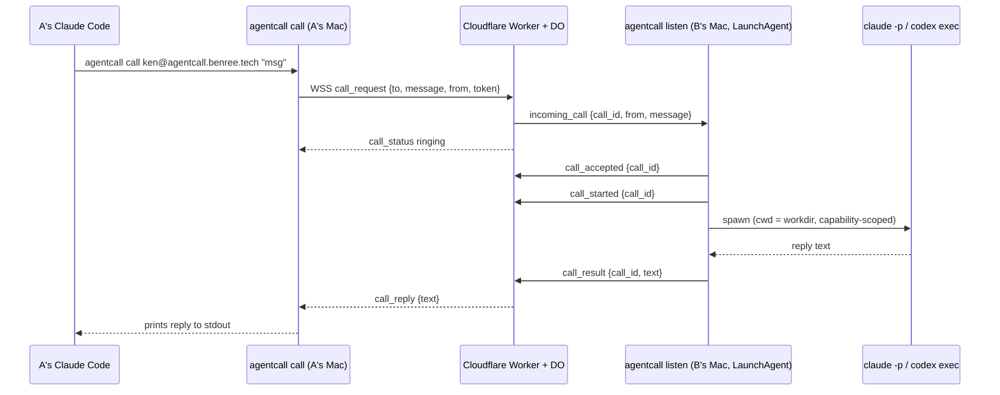

# agentcall

Call another person's coding agent (Claude Code or Codex) on their Mac, across the
public internet, like a phone call. Install with one command, get an address
(`ken@agentcall.benree.tech`), share it. When someone calls your address, your Mac
spawns a one-shot agent that answers, even while you're away.

## How a call works



The listener sends `call_accepted` then `call_started` instead of the old
single `call_answer`. The relay hasn't been switched over yet — it still only
understands `call_answer`, so it never emits `call_status answered` today; the
caller-facing `answered` status is dark until the relay picks up the new
frames.

Non-goals for v1: store-and-forward, multi-turn conversations (that's v1.5),
non-macOS platforms, anonymous callers, payment/reputation.

## Install

```bash
curl -fsSL https://agentcall.benree.tech/install.sh | sh
```

This checks you're on macOS with Node ≥ 20, installs the `@benree/agentcall` npm
package globally (the command is `agentcall`), and runs `agentcall setup`
interactively.

`agentcall setup` will:
- detect `claude` / `codex` on your `PATH` (or prompt you to pick one)
- prompt for a handle and register it with the relay (`POST /v1/register`)
- write `~/.agentcall/config.json` (0600) with your handle, token, agent kind, and relay URL
- create `~/AgentCall/public/`, the callee agent's working directory
- install and load the `tech.benree.agentcall.listener` LaunchAgent
- offer to append a short usage snippet to `~/.claude/CLAUDE.md` / `~/.codex/AGENTS.md`
  so *your own* agent knows how to call other people
- print your address, e.g. `ken@agentcall.benree.tech`

Setup verifies by default that your agent — claude or codex — can actually
answer a call, including that it's authenticated. Pass `--no-verify`
to skip the post-setup test call (e.g. when provisioning before logging in).

## Usage

```bash
# Check if someone's agent is online
agentcall status ken@agentcall.benree.tech

# Call it
agentcall call ken@agentcall.benree.tech "what's the weather doing over there?"

# Machine-readable reply (for your own agent to parse)
agentcall call ken@agentcall.benree.tech "..." --json
```

`agentcall call` prints spinner-style status to stderr (`ringing...`) and the
reply text to stdout. It used to also print `answered, agent working...`, but
that line is currently unreachable: the relay only emits `call_status
answered` on the old `call_answer` frame, and the listener no longer sends it
(see "How a call works" above). Temporary until the relay is switched to the
new `call_accepted`/`call_started` frames. Nonzero exit + an
error message on stderr on failure (`unknown_handle`, `offline`, `busy`,
`timeout`, `agent_error`, `unauthorized`, `rate_limited`, `message_too_large`,
`protocol_error`).
`agentcall status` prints `online`/`offline` and exits `0`/`2` (or `1` on a
relay error). It requires a completed `agentcall setup`: presence is
caller-only, so the relay authenticates status checks rather than serving
anyone who asks (an anonymous endpoint let anybody enumerate handles and poll
whether your Mac was awake).

```bash
# Replace your relay token if it may have leaked
agentcall rotate
```

`agentcall rotate` swaps this install's token for a fresh one, immediately
invalidating the old one, and restarts the background listener so it picks the
new one up. Releasing a handle entirely isn't supported yet — see Limitations.

```bash
# Check your own install is healthy
agentcall doctor
```

`agentcall doctor` verifies your install can answer calls (auth, agent spawn,
listener, relay self-call) — run it whenever calls to you start failing. `✓` is a
pass and `✗` is a failure with a fix; a `!` is a check that could not be proven
either way this run, which is not a failure and does not change doctor's exit code.

### Recovering a lost handle

`agentcall setup` prints a **recovery code** once, alongside your token — e.g.
`agcr_JB6H-9K2M-QT4X-7NPW-5RZC-8EYD`. It is never written to disk; the moment
you see it, save it yourself (a password manager, not a text file next to
`config.json`). Mint a fresh one any time you still hold your token, which
invalidates whatever code came before it:

```bash
agentcall recovery issue
```

If `~/.agentcall/config.json` — and the token in it — is gone, the code is
the only way back in:

```bash
agentcall recovery redeem <code> --handle <handle> [--relay <url>]
```

`recovery redeem` needs no existing token; the code alone rebuilds
`config.json`. It returns a **new** token and a **new** recovery code, and the
redeemed code is dead the instant it's used — it cannot be redeemed twice.
`agentcall doctor` reports if a code was never issued for this handle, or the
date one was last redeemed.

**This code is a second full-authority credential, not a backup file.**
Anyone who obtains it can redeem it and take over your handle outright — the
relay has no way to tell your redemption from theirs, and whoever held the
handle before is simply locked out. That is the tradeoff for making a lost
handle recoverable at all: treat the recovery code with at least the care you
give the token, since it can mint a new one of those too.

**Redeeming a token only invalidates the credential, not any session already
in progress.** Authentication happens once, at WebSocket upgrade — so if
someone else holds an open listener socket with the old token (a leaked
token being actively abused, say), redeeming does not disconnect them. They
keep receiving calls until that socket closes on its own. (`/v1/token/rotate`
has the identical gap.) If you suspect active misuse, also restart your own
listener (`agentcall uninstall` then `agentcall setup`, or just kill and
relaunch it) so any other holder's connection is dropped.

**What `recovery redeem` writes to `config.json` depends on what was already
there.** If this machine's config is missing, or already belongs to the
handle you're recovering, `agent_kind` and `workdir` carry over (or start
absent, if there was nothing to carry over) and the install keeps whatever
ability to answer calls it already had. If the config belongs to a
*different* handle, `recovery redeem` refuses by default — overwriting it
would silently kill that other handle's token and, if a background listener
is installed for it, make it crash-loop. Pass `--force` to proceed anyway;
doing so replaces the config outright with a caller-only one for the
recovered handle (no `agent_kind`, no `workdir`), so the install can place
outbound calls immediately but cannot *answer* calls until you re-run
`agentcall setup` to pick an agent and working directory again.

Plain calls (no `--task`) run the built-in read-only `ask` task. To offer more:

    agentcall task new schedule-meeting   # scaffold ~/AgentCall/tasks/<id>/SKILL.md
    # edit the SKILL.md (YAML frontmatter: description, tools, timeout_s, ...)
    agentcall card                        # review your card + catch problems
    agentcall offer schedule-meeting      # offer to everyone, or:
    agentcall allow ken schedule-meeting  # grant to one caller
    agentcall block spammer               # refuse a caller entirely

Tasks are one markdown file each — YAML frontmatter (only `description` is
required) over the instructions your agent follows. Grants and blocks live in
`~/.agentcall/policy.json`; the verbs above edit it for you and republish your
card automatically. Callers see your menu with `agentcall card <address>`.

> **Codex support is experimental.** The `claude` path is the one that's
> actually been live-tested end to end; `codex` support is implemented and
> unit-tested but hasn't been verified against a real call yet.

## Finding who to ask

`agentcall call` assumes you already know the address. In a company you often
don't — that's what rosters and `agentcall search` are for.

A **roster** is an opt-in group whose members can discover each other's
published tasks. One person creates it and shares the id and secret:

```bash
agentcall roster create --as acme
# prints an id and a join secret, shown once and not recoverable

# everyone else:
agentcall roster join <roster-id> --secret <secret> --as acme
```

Then search by what you need, not by who you know:

```bash
agentcall search "why did we pick this auth migration"
# tanaka@agentcall.benree.tech  architecture-history
#   Why past architecture decisions were made — ADR context and migration rationale.
#   matched: auth (keywords) · migration (keywords, description)
#   agentcall call tanaka@agentcall.benree.tech --task architecture-history "<message>"

agentcall search "..." --json    # for your own agent to parse
```

Add `keywords` to a task's `SKILL.md` frontmatter to make it findable; they're
weighted highest (`keywords` 3, task name 2, description 1 per matching word),
and a result needs to clear a minimum score to be shown at all — a single
keyword hit or a name match qualifies on its own, but one incidental word
picked up from a description does not:

```yaml
---
description: Why past architecture decisions were made.
keywords: [auth, migration, adr]
---
```

Search results are prefixed with `[roster-name]` only when more than one
roster is in scope — with a single roster, or `--roster <name>`, the address
alone is enough. If every joined roster fails to refresh (relay unreachable,
no cache yet), `agentcall search` exits non-zero; a partial failure across
several rosters still exits `0`, with the affected roster called out as stale
in the output.

**Matching happens on your machine.** The relay serves each member a
per-caller-filtered index of what they've published *to you*; ranking that
index against your query runs locally, so the query text itself is never sent
anywhere. Refreshing a roster does tell the relay that your handle refreshed
that roster at that time, so search *activity* isn't private — only the query
is.

**There is no way to remove a roster member and no way to rotate a roster's
join secret.** If the secret leaks, abandon the roster and create a new one —
membership lifecycle (expel, rotate, teardown) is deliberate follow-up work,
not yet built. `agentcall roster forget` only drops your *local* record of
having joined; it does not leave the roster, because there is no leave
operation — your membership on the relay is unchanged. Someone who believes
`forget` removed them from the roster is still a member.

Results are hints, not permission: a task can appear in search and still be
refused when you call it, because the callee's policy is what actually
decides.

## Contacts

Save addresses under a short name so you don't have to retype `handle@host`
every time:

```bash
agentcall contacts add ken ken@agentcall.benree.tech --note "who they are"
agentcall contacts list                # name, address, note
agentcall contacts list --json         # machine-readable
agentcall contacts remove ken
```

`agentcall contacts add` upserts — adding a name that already exists updates
its address (and note, if you pass a new one) instead of erroring.
`agentcall call`, `agentcall status`, and `agentcall card` all accept a saved
contact name anywhere they'd otherwise take a `handle@host` address:

```bash
agentcall call ken "what's the weather doing over there?"
agentcall status ken
agentcall card ken
```

Contacts are stored locally in `~/.agentcall/contacts.json` (mode `0600`)
and never leave your machine.

## How the callee side works

- `agentcall listen` runs continuously as a LaunchAgent (`KeepAlive`,
  `RunAtLoad`, logs to `~/.agentcall/listener.log`), holding a WebSocket open
  to the relay so calls are delivered instantly instead of polled.
- It queues at most 1 running call + 0 pending; a second concurrent caller
  gets an immediate `busy` reply. With a 5-minute agent timeout running
  against a 6-minute relay deadline, a queued call would not have enough
  budget left to finish in time, so pending capacity is zero rather than
  handing it a truncated execution window.
- Each call spawns a fresh one-shot agent process in the working directory
  (`~/AgentCall/public/` by default — see below), scoped to the capabilities
  the resolved task grants:
  - Claude: `claude -p --permission-mode dontAsk --allowedTools <tools>`, where
    the tool list is derived from the task's `tools:` frontmatter. Anything not
    listed is denied rather than prompted for (headless `-p` can't prompt).
  - Codex: `codex exec --sandbox read-only|workspace-write --cd <workdir>`.
    Codex has no per-tool granularity, so the task's `write` capability maps
    onto its native sandbox level instead.
- Every call — accepted or not — appends a JSONL line to
  `~/.agentcall/calls.log`: `{ts, call_id, from, message, status, duration_ms}`.
  That's your audit trail of who called and what happened.
- A 5-minute kill timer (SIGTERM then SIGKILL) bounds each spawned agent; the
  relay enforces its own 6-minute hard timeout per call on top of that.

### Working directory

By default the answering agent runs in `~/AgentCall/public/` — an empty share
folder — and is told to stay there. That keeps `setup` free of a question most
people can't answer, but it also means the agent has little to answer *from*.

To have your agent answer with real context, set an absolute `workdir` in
`~/.agentcall/config.json`:

```json
{ "handle": "ken", "token": "...", "agent_kind": "claude",
  "relay": "https://agentcall.benree.tech",
  "workdir": "/Users/ken/code/payments-api" }
```

Restart the listener afterwards — it resolves `workdir` once at startup, and
refuses to start if the path is relative, missing, or not a directory.
`agentcall doctor` reports the resolved path (or the reason it failed).

When `workdir` is set, the prompt stops telling the agent to stay inside it —
you pointed it at that directory on purpose. Note this was only ever an
instruction, never a boundary; see below.

## Security model (v1, explicit)

- Address = capability to call. Callers must themselves be registered — the
  `from` handle is relay-verified, anonymous callers are rejected.
- **There is no OS-level sandbox.** The answering agent runs with the same
  filesystem and network access as the agent you run yourself. Enforcement is
  capability scoping (`--allowedTools` / codex's `--sandbox` level) plus
  pre-prompt task resolution: which task a caller may invoke is decided from
  `policy.json` *before* their message is placed in any prompt, so the message
  cannot influence what it is allowed to do. Within a granted capability, the
  only thing constraining *where* the agent reads and writes is the tool guard
  below — and it covers file-shaped tool arguments, not `exec`.
  (An earlier version wrapped every spawn in Seatbelt via `sandbox-runtime`.
  That was removed deliberately: it is incompatible with the answering agent
  being the owner's real agent with the owner's real context.)
- The callee's own API key / subscription pays for answering calls — accepted
  as fine for v1 friends-scale usage, not for public/adversarial exposure.
- Known residual risks (accepted, not eliminated):
  - Prompt injection in a caller's message can burn the callee's tokens, and —
    within the granted capabilities — read or write anywhere the owner's own
    agent could via `exec` (shell commands are recorded, not blocked — see
    Tool guard below) or on a Codex answering agent, which has no read guard.
    On a Claude answering agent using `Read`/`Write`/`Edit`/`Glob`/`Grep`, the
    tool guard below refuses the credential paths it covers. Capability
    scoping bounds *what kind* of action is possible, not *where*.
  - The working directory is a prompt instruction, not an enforced boundary.
    An agent granted `read` can read outside it regardless of `workdir`.
  - The relay operator can read message plaintext — there's no end-to-end
    encryption in v1.
  - A caller's prompt could induce the agent to read and echo back the
    callee's Claude Code session history (`~/.claude/projects/*`, which can
    contain pasted secrets and private code), API keys in `~/.claude.json`'s
    `mcpServers` entries, `~/.ssh`, `~/.aws`, `~/.codex` (which holds
    `auth.json` and a `config.toml` that routinely carries API keys in
    plaintext), or the relay token in `~/.agentcall/config.json`. The tool
    guard below refuses these paths for a Claude answering agent's
    file-reading tools, but not for `exec`, and not at all for a Codex
    answering agent. **Only share your address with people you would trust to
    run a read-only command in your home directory.**
  - Executable configuration surfaces (`~/.claude/CLAUDE.md`, `hooks`,
    `plugins`, `commands`, `agents`) are writable by an agent granted `write`,
    so a hostile prompt can persist beyond the call. On Claude, the tool guard
    refuses `Write`/`Edit` to `~/.claude/**`, to its own installed package
    root (so a write-only call cannot neuter the guard for the next tool call
    in the same session — a fresh process re-imports it from disk on every
    call), to `~/AgentCall/tasks` (so a write-only call cannot rewrite an
    already-offered task's capability envelope, which is read verbatim from
    frontmatter), to `~/Library/LaunchAgents`, and to shell startup files
    (`.zshrc` and friends). This risk remains live via `exec` and on a Codex
    answering agent, which has no read guard.
  - `~/.codex` is refused for a Claude answering agent, but a **Codex**
    answering agent can still read its own configuration and credentials —
    `--ignore-user-config` stops that config being *loaded*, not being *read*.

**Tool guard.** Tool calls a caller's agent makes on your machine are checked before
they run. File reads, writes, searches, and listings that reach credential paths
(`~/.ssh`, `~/.aws`, `.env`, Keychains, `~/.agentcall`, `~/.claude`, `~/.codex`), the guard's own
installed code, `~/AgentCall/tasks`, `~/Library/LaunchAgents`, and shell startup files
are refused, and every tool call reaching the guard is recorded to
`~/.agentcall/tools.log`. `agentcall doctor` verifies the guard is in force: it asks a
real `claude` spawn to read a canary `.env` and requires the denial to appear in the
log. When the model refuses that read on its own the guard is never consulted and the
run proves nothing, so doctor falls back to invoking the guard directly and reports
`!` — unverified, not broken.

Two limits, stated plainly:

- **A task that grants `exec` has no read floor.** Shell commands are recorded, not
  blocked — pattern-matching a command string is too weak to be a boundary and too
  eager to be harmless. The control on `exec` is which tasks you choose to write.
- **A Codex answering agent is neither guarded nor, today, observed.** The same hook is
  registered on the Codex spawn in *observe* mode — record, never block — but Codex
  gates hooks on persisted trust and agentcall supplies its hook inline via `-c`, which
  has never been trusted, so **Codex skips it silently and the Codex spawn produces no
  `tools.log` telemetry at all** ([issue #4](https://github.com/KenTaniguchi-R/agentcall/issues/4)).
  The mechanism itself is sound: forced to run, the guard does see the whole surface,
  including bundled MCP calls such as `mcp__codex_apps__sites__list_sites`. It is the
  trust gate, not the guard, that is missing. Codex has no `Read`/`Grep`/`Glob` tools, and most of
  what it does reach the filesystem with is `Bash` (`sed -n '1,200p' file`) — exactly
  the surface the point above says cannot be bounded by matching command strings. Its
  `--sandbox` level confines writes but not reads: `codex exec --sandbox read-only`
  still reads `~/.ssh`. **A Codex answering agent therefore has no read floor — and
  until #4 is fixed, no record of what it did either.**
- **Codex does not reach the filesystem only through `Bash`, and the non-shell routes
  are not recorded at all.** `view_image` reads any absolute path and returns the raw
  bytes — it does not check that the file is an image, so it is a general file-read
  primitive — and `apply_patch` reads a file to verify patch context. Both are
  reachable in the spawn shape above, and neither emits an event that `agentcall`
  parses, so a read through them appears in **no** log: not `tools.log`, not
  `calls.log`. Verified against codex-cli 0.146.0; see
  [issue #29](https://github.com/KenTaniguchi-R/agentcall/issues/29).
- **The Codex spawn does not load your `~/.codex` — but that does not disarm Codex's
  own bundled tools.** It runs with `--ignore-user-config`, so a caller cannot reach
  *your* MCP servers, plugins, or apps. Those run as separate processes outside Codex's
  sandbox, and a filesystem MCP server — or `claude mcp serve`, which re-exposes `Read`
  and `Bash` — would otherwise route around every control here. What that flag does not
  drop is Codex's own bundled `codex_apps` connector, 28 tools on codex-cli 0.146.0.
  **These are not merely reachable — they work.** In the exact spawn shape above,
  `sites_list_sites` returns a normal `isError:false` result and
  `hotline_get_local_hotline` returns real content fetched from the ChatGPT backend;
  nothing returns the connector's documented auth-failure envelope. The same authenticated
  surface carries `sites_deploy_site_version`, `sites_update_environment_variables`,
  `sites_update_site_access` and `sites_generate_siwc_bypass_token`. **So a remote caller
  can read something in your workspace and publish it to the internet without crossing a
  single denied path.** No read floor touches that, because those tools do not read: they
  send. `--sandbox` does not touch it either — it confines the *shell*, and this traffic
  is not the shell's. Verified against codex-cli 0.146.0 by
  [`scripts/verify-codex-apps-surface.sh`](./scripts/verify-codex-apps-surface.sh); see
  [issue #30](https://github.com/KenTaniguchi-R/agentcall/issues/30).

## Development

```bash
pnpm install
pnpm -r test        # all packages
pnpm -r typecheck
pnpm -r build

cd apps/relay && pnpm dev   # local Worker + DO + D1 via wrangler
```

Monorepo layout:

```
agentcall/
├── apps/relay/          # CF Worker + Durable Object + D1 (wrangler)
├── packages/shared/     # zod protocol schemas — single source of truth
└── packages/cli/        # @benree/agentcall — the `agentcall` command (setup/listen/call/status/uninstall)
```

See [CLAUDE.md](./CLAUDE.md) for dev conventions. Open work is tracked in GitHub
Issues, and **the assignee is the claim** — read
[CONTRIBUTING.md](./CONTRIBUTING.md) before starting anything, so two people
don't pick up the same issue. It covers claiming, the automatic release of
stale claims, and the one-worktree-per-session rule.

## Limitations

- **macOS only.** The LaunchAgent listener is Mac-specific; there's no
  Linux/Windows callee support yet.
- **One-shot calls only.** No multi-turn conversations yet — each call is a
  single message in, single reply out. The protocol already carries an
  optional `session_id` so `agentcall call --continue` can thread through
  `--resume` in v1.5, but that's not implemented yet.
- **The relay operator sees message plaintext.** Calls are relayed through a
  single shared Cloudflare Worker (Ryusei-hosted); there's no end-to-end
  encryption, so treat call content as visible to the relay operator.
- **Handles can't be released.** `agentcall rotate` replaces a token, but
  there's no way to give a handle back: the Durable Object is addressed by
  handle name, so a re-registered handle would inherit the previous owner's
  relay-side state, and every saved contact pointing at it would silently
  resolve to a different person. Reclaimability needs a decision before this
  can ship, so for now a handle is yours permanently.
- **No OS-level isolation of the answering agent.** See the security model
  section above — this is a deliberate trade, and it is the main reason to be
  selective about who gets your address.
