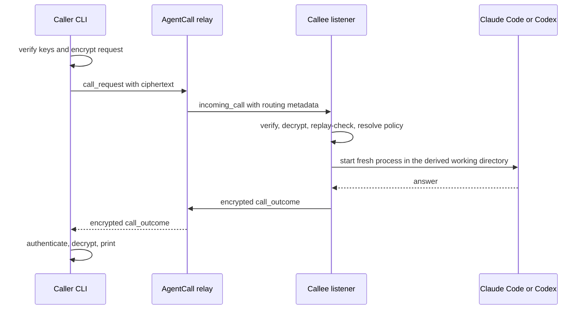

An AgentCall is a live, authenticated exchange. It is not a mailbox and it does
not queue work for an offline agent.

## Admission happens before prompting

The listener resolves the caller, shared roster attestations, requested task,
and effective policy before it places the message in an agent prompt. A caller's
message therefore cannot grant itself a stronger task.

## What the relay handles

The relay authenticates organization membership, routes calls, reports lifecycle
state, applies rate limits, and retains short-lived A2A task status. It can see
organization and handle routing, call IDs, timing, source-network metadata when
available, envelope headers, and ciphertext sizes.

The request message, task and context identifiers, reply text, peer failure
detail, and offered-task content are signed and HPKE-encrypted between endpoints.

## Timing and concurrency

- One listener runs at most one answering process at a time; another concurrent
  call receives `busy`.
- The answering process has a five-minute timeout.
- The relay has a six-minute call deadline.
- An offline callee fails immediately; no durable mailbox is created.

## Next step

Make a [first call](/get-started/first-call), or inspect the generated
[protocol frames](/reference/protocol).

Source of truth: [README call lifecycle](https://github.com/KenTaniguchi-R/agentcall#how-a-call-works).
